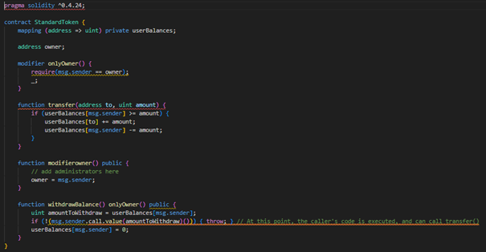
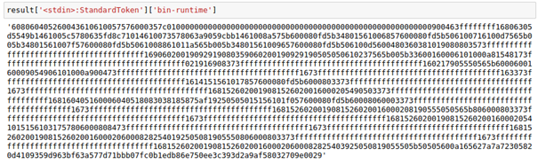

# File and Folder introduction of CFG

## Visualization

The folder "Visualization" involves the visualization result of two contract examples. For each example, we show the contract's source code, opcode,  bytecode, and AST files, as well as visualization dot and PNG files. These dot files are generated by VulHunter and existing SOTA CFG reconstruction tools such as EtherSolve, and ILF. Then, the PNG files are visualized by the dot command.

## Extracted_instances

The folder "Extracted_instances" includes the contract instances after operations loss, repeat, and out-of-order. For each operation, we selected opcode change ratios of 3%, 5%, 7%, and 10%, respectively.

## Experiment_figures

The folder "Experiment_figures" shows the experiment result of VulHunter in various scenarios, i.e., loss, repeat, and out-of-order. These results depict the changes of ACC, P, R, and F1 metrics.

## CFG_results_2vs1.xlsx

The file "CFG_results_2vs1.xlsx" illustrated the detection metrics (i.e., accuracy, precision, recall, and F1) of VulHunter in various scenarios on Dataset_1. Also, the settings are consistent with the Dataset_1 experiment under the contract proportion of 2:1.


# Guarantee for the correctness of CFG Construction

We demonstrated the correctness of the control-flow graph (CFG) reconstruction process from two levels of theory and implementation, and explored the impact of imprecise CFG on VulHunter performance.

## Theoretical Correctness of CFG Construction

In this section, we supplement the details of the CFG reconstruction, and clarify its feasibility, universality, and correctness at the theoretical level.

In fact, the accurate extraction or reconstruction of the CFG from the bytecode is essential to the success of many static/dynamic analysis algorithms [ESEM_CFG]. However, the design of the EVM bytecode language does not allow for an easy reconstruction of the contract's CFG since the jump destinations may not be statically fixed but might be dynamically computed. More precisely, in EVM, the bytecode jump destinations need to be read from the stack during the actual execution, which hinders the CFG reconstruction. Recently, most contract detection methods based on pattern matching (e.g., Slither [ICSE_Slither] and Securify [CCS_Securify]), symbolic execution (e.g., DefectChecker [TSE_DEFECTCHECKER] and Oyente [CCS_Making]), and fuzzy testing (e.g., ILF [CCS_ILF] and SynTest-Solidity [ICSE_SynTest-Solidity]) have been devoted to recovering more accurate CFG of contract programs. Specifically,

>- Slither [ICSE_Slither]: Slither is a static analysis framework designed to provide rich information about Ethereum smart contracts. It works by converting Solidity contracts into an intermediate representation called SlithIR. SlithIR uses a Static Single Assignment (SSA) form and a reduced instruction set to ease the implementation of analyses while preserving semantic information that would be lost in transforming Solidity to bytecode. It recovers important information such as the contract’s inheritance graph, CFG, and the list of expressions based on the contract abstract syntax tree (AST) generated by compiles such as Solc.
>- Clairvoyance [ASE_Clairvoyance]: Clairvoyance is a cross-function and cross-contract static analysis by identifying infeasible paths to detect reentrancy vulnerabilities in smart contracts. It constructs the cross-contract call graph and CFG (named XCFG) among the input smart contracts. Among them, cross-contract call graphs (XCGs) for Solidity programs, which are directed graphs where nodes are Solidity functions and edges between them denote calling relations. For each function inside the XCG, it builds the CFG adopted from SlithIR after the AST parsing.
>- DefectChecker [TSE_DEFECTCHECKER]: DefectChecker is a symbolic execution-based approach and tool to detect eight contract defects that can cause unwanted behaviors of smart contracts on the Ethereum blockchain platform. It can detect contract defects from contracts’ bytecode. Also, it leverages symbolic execution to symbolically execute each single EVM instruction one at a time and then obtain the CFG for contracts. After constructing the CFG, it traverses the path of the CFG by utilizing DFS (Depth-first-search) to detect which block is the start of a loop and which blocks make up the body of the loop.
>- Securify [CCS_Securify]: Securify is a security analyzer for Ethereum smart contracts that is scalable, fully automated, and able to prove contract behaviors as safe/unsafe with respect to a given property. It first symbolically analyzes the contract’s dependency graph to infer data- and control-flow dependencies and extract precise semantic information from the code. Then, it checks compliance and violation patterns that capture sufficient conditions for proving whether a property holds. Note that it constructs the CFG by traversing the AST of contracts generated by a compiler called Souffle.
>- ILF [CCS_ILF]: ILF is a fuzzer for Ethereum contracts that generates sequences of transactions achieving high coverage on real-world contracts (deployed on Ethereum). It disassembles the bytecode and constructs CFG from the disassembled instructions. Then, it recovers function entry blocks by their unique 4-byte identifiers (EVM uses the identifiers like a dispatch table to jump to the entry of each function). For every function, it traverses the basic blocks starting from the entry, computes backward slicing of each sload and sstore instruction, and recovers the read and write offsets.
>- Oyente [CCS_Making]: Oyente is a symbolic execution tool that analyses Ethereum smart contracts to detect bugs. It first traverses the opcode sequence to generate a skeleton CFG with terminal/unconditional/conditional blocks, i.e., an incomplete CFG that is used to execute symbolically from a concrete state. Then, it uses the Z3 solver to determine which path is more probable while generating the CFG, and it detects which paths are directly unfeasible by solving the path constraints.
>- EthIR [ATVA_EthIR]: EthIR is a framework that generates a high-level rule-based representation from low-level EVM bytecode. It extends the Oyente framework and generates a CFG to discover the possible vulnerabilities in smart contracts.
>- Gastap [Gastap]: Gastap is a tool that infers parametric gas bounds from an EVM contract. It relies on EthIR for obtaining the rule-based representation and generates a Control-Flow-Graph (CFG) as an intermediate representation of the analysis. Same as Oyente, its CFG generation relies on determining the possible jump directions, which exclusively depends on the stack. Then it traverses CFGs to detect dead blocks, opaque predicates, and discover loops.
>- sCompile [ICFEM_sCompile]: sCompile is a symbolic execution-based CFG construction tool for smart contracts, and it identifies critical program paths from the generated CFG. Also, it can alleviate path explosion by just exploring critical paths, while leaving the other paths unexplored.
>- MAIAN [ACSAC_Maian]: MAIAN is the first tool for precisely specifying and reasoning about trace properties, which employs inter-procedural symbolic analysis and concrete validator for exhibiting real
>- exploits. It searches the space of all execution paths in a trace with a depth-first search, and validates the satisfiability of the symbolic conditional expression by querying an external SMT solver.
>- Mythril [Mythril]: Mythril is a security analysis tool for EVM bytecode that detects security problems in smart contracts. It does not build a CFG, but rather it generates a trace tree given by symbolic execution and Satisfiability Modulo Theories (SMT) solving.
>- evmdis [evmdis]: evmdis is a disassembler that leverages reaching definition analysis to separate bytecode into basic blocks, perform the jump target analysis, and provide insight into the state of the stack at the start of each block.
>- Miasm [Miasm]: Miasm is an open-source de-reverse engineering framework that provides a range of tools and libraries for analyzing and reverse engineering binary code. It disassembles the binary code, identify basic blocks within the program, and then incorporates symbolic execution techniques to establish their connection.
>- Porosity [Porosity]: Porosity is a popular reverse engineering tool specifically designed for analyzing and decompiling the EVM bytecode of smart contracts. It performs control flow analysis on the smart contract code, providing insights into how the program's execution flows and identifying potential control flow vulnerabilities or logical issues.
>- EtherSolve [ICPC_EtherSolve, JSS_EtherSolve]: EtherSolve is a tool for the control-flow graph extraction from Ethereum bytecode. It presents a novel static analysis algorithm based on the symbolic execution of the Ethereum operand stack that allows us to resolve jumps in Ethereum bytecode and to construct an accurate control-flow graph (CFG) of the compiled smart contracts.
>- Octopus [Octopus]: Octopus is a security analysis framework for EVM bytecode. It leverages symbolic execution to produce a CFG, thus supporting reverse engineering and understanding the internal behavior of smart contracts.
>- Vandal [Vandal]: Vandal is a static analysis framework for smart contracts that decompiles the EVM bytecode to an intermediate representation. It statically propagates constant values to identify the potential jump addresses and then builds the contract CFG.
>- Gigahorse [ICSE_Gigahorse]: Gigahorse is a decompiler that transforms EVM bytecode into a high-level 3-address code representation. It computes the targets of jump instructions based on the stack analysis.
>- GasChecker [TETC_GasChecker]: GasChecker is a heavy-weight program analysis technique based on symbolic execution. It disassembles the bytecode and constructs the control flow graph (CFG) with unconditional and conditional jumps during path exploration.
>- Manticore [ASE_Manticore]: Manticore is a symbolic execution framework for analyzing binaries and smart contracts. It presents modules like the SMT-LIB module that supplies a custom symbolic expression object model and an SMT solver interface, such as Z3.
>- eThor [CCS_eThor]: eThor is the first sound and automated static analyzer for EVM bytecode, which is based on an abstraction of the EVM bytecode semantics based on Horn clauses. Its reconstructed control flow is obtained by a Soufflé [CAV_Soufflé] program, which was created by manually translating a HoRSt specification. Also, it approximates the contract jump destinations with less precise abstract semantics.
>- Eclone [FSE_Eclone]: Eclone is a semantic clone detector for Ethereum based on Symbolic Transaction Sketch, i.e., a set of critical semantic properties generated from symbolic transactions. It uses the Solc compiler to generate EVM bytecode and reuses the Symbolic Execution Engine from Oyente to create the CFG of contracts.
>- SynTest-Solidity [ICSE_SynTest-Solidity]: SynTest-Solidity is an automated test case generation and fuzzing framework for Solidity. SynTest-Solidity implements various metaheuristic search algorithms, including random search (traditional fuzzing) and genetic algorithms (i.e., NSGA-II, MOSA, and DynaMOSA). The tool takes as input a smart contract, parses the source code to obtain the contract AST, and then builds the CFG with a custom script.

Similar to VulHunter, the CFG reconstruction process of these methods usually performs a pipeline of block identification, edge building, and path traversal. Among them, graph nodes are basic instruction blocks, edges represent control flow transfers between instruction blocks, and paths refer to the opcode sequences for contract executions. As the first stage of CFG reconstruction, the operations of block identification are almost the same for all methods. As detailed in Section 3.3 of the paper, a basic block is a sequence of opcodes that are executed consecutively between a jump target and a jump instruction, without any other instruction that alters the flow of control [TSE_DEFECTCHECKER, ICPC_EtherSolve]. Consequently, opcodes that change the control flow of the contract execution divide the opcode sequence into basic blocks. As mentioned in Section 2.1 of the paper, opcodes JUMP, JUMPI, STOP, REVERT, RETURN, INVALID, SELFDESTRUCT mark the end of a basic block, whereas JUMPDEST usually marks the beginning of a new basic block.

Among them, JUMP is an unconditional jump whose jump target is specified by the top item of the stack. JUMPI is a conditional jump that transfers the control flow to the target specified by the top stack item if the second stack item is not zero; otherwise, the operation following the JUMPI will be executed next. A jump target is marked by JUMPDEST instruction. In particular, an intra-contract function invocation (e.g., a function calls another function in the same contract) is compiled into JUMP instruction, and CALL instruction is employed for inter-contract invocation (e.g., a contract invokes another contract). Besides, SSOTRE/SLOAD instructions store values and load values from memory, respectively. CALL/CALLCODE/DELEGATECALL is responsible for sending message calls. These types of opcodes are beneficial for us to capture the high-level semantics of smart contracts. In this way, the types of blocks are assigned terminal, conditional, and unconditional according to the end instructions.

The second phase involves constructing edges for the basic blocks, which is actually the most important and challenging step in the CFG construction process. As mentioned above, the challenge of this stage lies in identifying the jump destinations for each branch instruction (JUMP or JUMPI). This stems from the following facts [ICPC_EtherSolve]. To this end, the aforementioned methods mainly leverage symbolic execution (e.g., DefectChekcer [TSE_DEFECTCHECKER] and EtherSolve [ICPC_EtherSolve]) and compiler (e.g., evmdis [evmdis] and Miasm [Miasm]) technologies to address this issue. Among them, the latter leverages technologies such as partial evaluation to build connections between blocks based on information extracted from the compiler, e.g., AST or disassembly structures. In contrast, the former infers the jump destinations of the block based on the EVM stack by simulating the execution of the instructions in each block. Given that the authentic bytecode jump destinations are available on top of the stack and dynamically computed by previous instructions, which is similar to the former, we adopt it to reconstruct the jumps between the basic blocks. Specifically, the jumps of conditional and unconditional blocks perform the conditional and unconditional jumps, respectively. Also, the jumps of blocks involve the following several situations.

1. The terminal block has no successors as the control flow is interrupted.
2. The JUMP instruction of unconditional blocks is preceded by a PUSH instruction: the pushed argument is the jump destination offset, and the corresponding edge is added to the CFG.
3. The JUMPI instruction of conditional blocks is preceded by a PUSH instruction: the false branch goes to the following block (in offset order), and the true branch uses the pushed argument as the jump destination offset. In this case, two corresponding edges are added to the CFG.
4. The JUMP/JUMPI instruction is not immediately preceded by a PUSH instruction: the jump destination needs to be resolved through symbolic stack execution, which is performed frequently during the symbolic execution process.
5. In any other case, the control flow proceeds with the basic block in the next position in the bytecode.

The third stage refers to the path traversal, which performs the DFS (DepthFirst Search) based on the constructed CFG to generate the execution paths, as detailed in Section 3.4 of the paper. This process is similar to the aforementioned methods, such as DefectChekcer [TSE_DEFECTCHECKER], EtherSolve [ICPC_EtherSolve], and ILF [CCS_ILF].

> In total, the CFG reconstruction method is consistent with the current symbolic execution-based methods that infer the jump destinations on the EVM stack, which were proposed in the top conferences and journals, due to it being inspired by them. This helps to demonstrate its correctness, universality, and effectiveness. In fact, although the CFG reconstruction is essential to VulHunter and its correctness will directly affect the performance, the highlights of this paper is how to leverage ML to help traditional formal analysis methods address their challenges, i.e., the development of expert-based detection rules or oracles for massive vulnerability types. Notably, as detailed in Section 3.7 of the paper, the constraint-solving module can construct the symbolic constraints of paths and solve them to obtain the inputs that meet the conditions by SMT solvers such as Z3, thus validating the feasibility of paths. This is not only beneficial to eliminate some unreachable paths caused by unsound CFGs, but also false positives of infeasible instances. Nonetheless, a complete contract analysis method needs to consider the impact of imprecise and unsound CFG, given the difficulty of CFG reconstruction. To this end, we evaluate the performance of VulHunter in this situation and illustrate the deep insights for its robust detection, detailed in the third section of this page.

## Implementation correctness of CFG construction

In this section, we illustrate the implementation of the CFG reconstruction, and clarify its rationality, recognition (i.e., extensiveness), and advancement. Also, we explain its reliability and correctness by comparing the reconstructed CFG with the existing SOTA tool in a visual manner.

As mentioned in Section 4.1.2, in order to restore the contract CFG according to the above reconstruction method and ensure its efficiency, VulHunter considers the more accurate, widely used, easy-to-use, and open-source CFG library evm_cfg_builder v0.3.1 [evm_cfg_builder] at the stage of module implementation. This library was developed by Trail of Bits and widely promoted by many websites such as [openzeppelin] and [Ghidra], as an example shown in the below figure. 


Notably, it holds the following advantages [openweaver].

>- It can reliably recover the CFG from EVM bytecode and find all branches of the CFG from the contract memory.
>- It can recover function names and attributes (e.g., payable, view, pure) of contracts.
>- It provides a lot of auxiliary operations such as exporting CFG to a dot file, and it can be easily performed secondary development by using its library API.
>- It is developed completely and has 89112 lines of code, 99 functions, and 12 files.
>- It is developed reliably and has no vulnerabilities reported, as well as security hotspots that need review. Also, it was scanned for known vulnerabilities and missing licenses, and no issues were found. This fact is applied to its dependent libraries. Thus, it was deemed as safe to use.
>- It has been visited by many users and received a total of 334 weekly downloads.

More importantly, we employ this library as it has been wildly used in a lot of top conference and journal papers, as well as large engineering projects or products [CFG_Applications, Luxembourg]. Specifically, it is employed by Manticore [ASE_Manticore], Slither [ICSE_Slither], Ethersplay [Ethersplay], and other tools from Trail of Bits. Among them, Manticore and Slither were presented in the previous section. Also, Clairvoyance [ASE_Clairvoyance] builds the CFG based on SlithIR and utilizes this library indirectly. The similar tools also include SoliDetector [TR_SoliDetector], AI-framework [IS_AI-framework], and MANDO-GURU [FSE_MANDO-GURU]. 

Furthermore, there are many influential methods that have implemented CFG reconstruction based on this library directly.

>- Eshield [ISSTA_Eshield]: EShield is an automated security enhancement tool for protecting smart contracts against reverse engineering. It uses the evm-cfg-builder to recover the CFG of smart contract bytecodes. During the CFG reconstruction, it marks every JUMP or JUMPI instruction with their jump addresses and keeps them in key-value pairs named jump-pairs.
>- Elysium [RAID_Elysium, Luxembourg]: Elysium is a scalable approach toward automatic smart contract repair at the bytecode level. It builds the CFG by using the evm-cfg-builder Python library. Then, it gathers context-related information by traversing the CFG and leverages taint analysis to infer information about integer types and free storage space.
>- Similarity [Electronics_Similarity]: This paper proposes a series of methods to measure the similarity of smart contract bytecode. It forms a CFG by evm-cfg-builder library before decompilation and conversion. Also, it simulates the execution of smart contract bytecode by traversing the CFG.
>- CFG [CISAI_CFG]: This paper presents a method to measure the similarity of smart contract bytecode. It uses evm-cfg-builder library to build the decompiled intermediate representation of bytecode into CFG, and the analysis of CFG improves the similarity detection.
>- AGSolT [AGSOLT]: AGSolT is an automated test case generation tool for unit testing for the smart contract programming language Solidity on the Ethereum blockchain. Its CFG is distilled from the bytecode using the evm-cfg-builder Python library.
>- TextCNN [WCMC_TextCNN]: TextCNN is a vulnerability detection model based on the fusion of syntax and semantic features. In its conversion of smart contracts to CFGs, the smart contracts are first compiled into opcodes, and then the opcodes are converted into CFGs by evm-cfg-builder library. 

In addition, this library has been used in several larger projects and products. For instance, as a tool using this library, Ethersplay [Ethersplay] is an open-source protocol for disassembling EVM byte code, and developers can use it to reverse engineer existing code to understand the underlying contracts involved. As shown in the below figure, it serves as a Binary Ninja plugin to propose a professional and beautiful interface to display the contract CFG.


Also, as another project, Ghidra-EVM [Ghidra] is a Ghidra module for reverse engineering smart contracts, whose interface is shown in the below figure. It relies on the evm-cfg-builder library to assist Ghidra in the CFG generation process. This tool can be used to download Ethereum Virtual Machine (EVM) bytecode from the Ethereum blockchain and disassemble and decompile the smart contract. Moreover, it can analyze creation code, find contract methods and locate insecure instructions. 


Besides, in order to evaluate the correctness of the CFG reconstruction, we first developed a script to visualize the CFG generated by VulHunter, and then compared it visually with superior open-source CFG recovery tools, such as EtherSolve [ICPC_EtherSolve] and ILF [CCS_ILF]. Specifically, (i) we used compilers such as Solc to generate the bytecode and opcode of the contract. (ii) We employed the custom script to save the CFG reconstructed by VulHunter to a PNG image. (iii) We executed the EtherSolve tool to output its CFG in a “.dot” file. (iv) We added two statements “contract_manager = execution.get_contracts()” and “contract_manager .dump('CFG')” into the primary function of the ILF program, and ran it to generate its reconstructed CFG in the SVG format. (v) We utilized the dot tool to translate “.dot” file into a PNG image. As an example of the Test contract in the file “toy.sol”, the execution commands in the terminal are listed below. Among them, the folders toy, toy_ethersolve, and toy_ilf refer to the methods VulHunter, EtherSolve, and ILF, respectively.

```
solc -o toy_evm --bin --ast --asm toy.sol
python cfg_plot.py toy.sol 0.4.24 toy
java -jar EtherSolve.jar -c -d -o toy_ethersolve/Test.dot toy_evm/Test.bin
python -m ilf --proj toy_ilf/ --contract toy --fuzzer imitation --model ./model/ --limit 2000
dot -T png toy_ethersolve/Test.dot -o toy_ethersolve/Test.png
```

1. The visual example of Test contract.

The source code of Test contract is shown in the below figure.


The runtime bytecode compiled by Solc v0.4.24 for this contract is shown in the below figure.


The visualization results of the three tools are shown in the figure below, followed by VulHunter, EtherSolve, and ILF. It can be seen that the CFG reconstruction results of three tools are consistent.

<div></div>

2. The visual example of StandardToken contract.

The source code of StandardToken contract is shown in the below figure.



The runtime bytecode compiled by Solc v0.4.24 for this contract is shown in the below figure.



The visualization results of the three tools are shown in the figure below, also followed by VulHunter, EtherSolve, and ILF. It can be seen that the CFG reconstruction results of three tools are consistent.

<div></div>

> In conclusion, similar to the SOTA contract analysis methods, VulHunter is committed to implementing each module of the prototype more accurately, completely, and efficiently based on the advanced libraries, e.g., evm_cfg_builder [evm_cfg_builder] for CFG construction and pyevmasm [pyevmasm] for bytecode-opcode conversion. These libraries have been wildly used in methods of top conference and journal papers, as well as large engineering projects or products. This is beneficial to demonstrate the rationality, recognition, and advancement of VulHunter implementation. Also, the same visualization results with other SOTA CFG reconstruction tools can indirectly reflect the correctness of the implementation. Given the significance of CFG reconstruction and the decoupling nature of modules in the prototype, the attempts with these specialized tools inspire us to incorporate them into VulHunter for user selection. As CFG recovery technology evolves, this design may allow it to improve detection performance in the future by embracing more superior components.

## The impact of imprecise CFG

As detailed above, VulHunter and other SOTA methods strive to reconstruct a sound and precise CFG. Nonetheless, it is necessary to consider the potential impact of an unsound or imprecise CFG on the method, given the challenges of the reconstruction of CFG, i.e., the computation of the jump destination. To this end, we simulate scenarios such as block loss (missed edge connections), block out-of-order (incorrect edge connections), and block repeat (abnormal loop operations) by deleting, replicating, and shuffling opcode sequences in the execution paths (i.e., instances). This allows us to quantify the relationship between vulnerability detection evaluation metrics and the imprecise instances or CFGs. Specifically, due to limitations in graph representation, we only present the variations of detection metrics for six representative vulnerabilities in each level (consistent with Tables 6, 7, and 13 in the paper) with changes in the degree of deletion (loss), replication (repeat), and shuffling (out-of-order). The experimental results are shown in the below figures.

<div></div>
<div></div>
<div></div>
<div></div>

It can be seen that they reflect the following three facts.

1. **Mild perturbations caused by imprecise CFGs don't always have an adverse impact and can sometimes help the model learn effective vulnerability features.** In cases of loss, repeat, and out-of-order, most vulnerabilities, such as RE and TS, carry an improvement in detection metrics. Specifically, out-of-order operations mostly exhibit a slight downward trend, but there are some upward fluctuations. This may be attributed to some relevant opcode information becoming more concentrated during the transformation process, making the model easier to learn vulnerability features. Also, repeat operations may expand the information of critical vulnerable segments/CFG blocks in the contract, so that the relevant information observed by the model increases to facilitate vulnerability detection. 

   Similarly, loss operations might ease the model to identify the key vulnerable segments, as non-critical or redundant opcode sequences/CFG blocks of some contracts are ignored during the perturbation process, making it sensitive to vulnerability features and improving identification accuracy. Notably, the improvement phenomenon is relatively significant in this operation, indicating that key vulnerable fragments account for a minority in the instances. On the one hand, this hinders the performance of traditional bytecode-level detection methods, as it is challenging to discern effective vulnerability features and develop corresponding detection logic in patterns or oracles. In such cases, the application of ML can help them overcome this challenge, e.g., the discovery of vulnerable source code statements and key opcode/bytecode fragments identified by VulHunter can assist in formulating relevant detection logic. On the other hand, a lot of irrelevant/useless information also restricts the recognition capability of existing ML-based methods. To this end, VulHunter constantly adjusts the receptive fields of the model to discover the subtle vulnerability features under the guidance of self-model and package-instance hybrid attention mechanisms, as the fluctuation of precision and recall shown in the above figure. Nonetheless, as the perturbation ratios increase, the slight downward trend indicates that key vulnerability features will still be lost. This also reflects that it is essential to equip a superior CFG reconstruction method, which can allow VulHunter to further improve its performance in the future.

2. **Against the imprecise instance or CFG construction caused by a mild disturbance, the detection for most vulnerabilities (e.g., RE, TS, CAL, LLC, UCL) are relatively stable and maintain a significant performance, such as the fluctuation range of ACC does not exceed 4%.** This can be attributed to the keen observation of the VulHunter model based on attention and MIL mechanisms, so that it can still accurately learn critical and subtle features despite slight changes. This also reflects its robustness in identifying defects, which can tolerate some slight bias on instance generation or CFG reconstruction. However, these perturbations may invalidate pre-defined patterns or oracles of traditional detection methods (e.g., pattern matching, symbolic execution, and fuzz testing), thereby hindering their vulnerability identification and causing false positives or miss reports [CFG_Applications]. 

   In fact, this can also be abstracted as a manifestation of vulnerability evolution or concept drift. Due to most vulnerabilities in the real world may continue to evolve, the number of detection rules increases significantly, and it is difficult to develop detection logic for them separately. At this time, ML is a method worth considering, that is, fine-tuning model parameters based on evolved vulnerability contract samples, allowing it to identify these vulnerability variants, which can help traditional methods to solve this problem. Notably, unlike other ML methods, VulHunter can not only accurately identify these vulnerabilities, but also output the vulnerable contract execution sequences, defective source code statements, and key bytecode/opcode. This additional and valuable information can inspire traditional symbolic executors and fuzzes to customize and maintain new detection strategies for vulnerabilities, as well as even repair measures. In addition, the weak impact may result from the less proportion of effective vulnerable fragments or CFG blocks, so that slight perturbations will not affect them, which may be more significant in large CFGs. Also, the permutations on non-critical opcode subsequences or blocks will not cause much harm to the identification results. On the contrary, these imprecise instances or CFG reconstruction may fail the path inference of methods based on symbol execution and fuzz testing, given their unreachability.

   Of course, there are a few defects that are sensitive to instance changes, such as ST optimization. This can be attributed to the fact that the optimization aims to identify the send function, which consists of GAS and CALL instructions in the bytecode. The changes in sequences will separate them or disappear one part, which may make the model mistakenly understand that the CALL instruction is the key to identifying this optimization. However, the only CALL instruction often refers to the low-level call functions in the source code. Therefore, these changes will lead the model to not only identify the send function, but also inaccurately regard the call function as the send function, resulting in a relatively stable recall rate but a decline in accuracy, accuracy, and F1 score. Conversely, the identification of low-level-calls defect is more stable. These phenomena also apply to traditional bytecode-level detection methods, as they distinguish send and call operations according to the CALL instruction. Overall, it is necessary to explore the application of ML methods in the field of contract vulnerability detection. It can not only solve the rule-making bottleneck of traditional formal methods, but also enable VulHunter to complete the robust identification of the contract execution paths (i.e., instances) under weak disturbances.

3. **The impact of disturbance strategies on detection performance is associated with the vulnerability features.** For vulnerabilities sensitive to temporal connection, such as RE (read state variables, invoke call function, and write state variables) and UCL (invoke call function and judge execution status), the influence of out-of-order operations is more significant. This indirectly reflects that VulHunter can indeed perceive the logical relationship between these vulnerable opcode sequences at the bytecode level by employing the bidirectional LSTM model. For example, the order change of SLOAD/CALL/SSTORE key opcodes will interfere with the judgment of the model for the reentrancy-eth vulnerability, thus reducing its recall rate, but the accuracy rate is stable. This fact is applied to the UCL vulnerability with the CALL/ISZERO opcodes. Moreover, for optimizations such as timestamp that rely on individual opcodes, the model will more easily observe the clear instructions such as TIMESTAMP after the loss of non-relevant opcodes, i.e., their ACC and F1 will be improved under this operation. In contrast, when other opcodes are gradually repeated, the critical TIMESTAMP instruction will be diluted to restrain model identification, i.e., their ACC and F1 will first rise and then drop in the repeat operation.

## Conclusion of CFG construction

In summary, like traditional SOTA contract detection methods such as pattern matching, symbolic execution, and fuzz testing, VulHunter strives for perfect CFG reconstruction and instance generation at both theoretical and implementation levels, which reflects its feasibility, generality, and correctness. Nevertheless, given the challenges of CFG reconstruction, it is necessary to consider the impact of imprecise instances caused by unsound CFG reconstruction. These perturbations may cause the misreports of pre-defined rules in traditional detection methods and even lead their analysis to fail. To this end, VulHunter leverages ML to automatically learn the subtle features in normal and vulnerable contract datasets, thereby allowing it to tolerate the impact of some instance deviations and ensure the detection effect of vulnerabilities.

Also, compared with other ML-based methods, VulHunter leverages the MIL mechanism to focus on the runtime execution paths of contracts, and employs the self-model and package-instance hybrid attention mechanisms to identify defective source code statements and key opcode subsequences. This information can assist contract developers or auditors in improving the contract's lifecycles, and help traditional detection methods overcome the rule-making bottleneck. For example, VulHunter incorporates an optional constraint-solving module to construct symbolic constraints of vulnerable paths, and employs SMT solvers such as Z3 to compute the parameters/inputs that meet the conditions, thereby verifying the feasibility of paths and eliminating false positives. This can also discover erroneous paths caused by imprecise CFG reconstruction. During this process, the role of ML models is to translate the manual detection logic of symbolic execution-based methods into the super parameter representation (or logic rules of traditional ML methods such as random forests) after training, enabling them to perform effectively without the involvement of experts.

Finally, like traditional detection methods, we also advocate for improvements in the CFG reconstruction module to improve the performance of VulHunter. Given the decoupling nature of modules in VulHunter, it can integrate some custom or superior SOTA CFG reconstruction methods to provide contract detection services according to the user's choice. In the future, we will further study and follow such work to serve the VulHunter and traditional detection methods better.

## References

- [ESEM_CFG] Ting Chen, Zihao Li, Yufei Zhang, Xiapu Luo, et al. A large-scale empirical study on control flow identification of smart contracts[C]//2019 ACM/IEEE International Symposium on Empirical Software Engineering and Measurement (ESEM). IEEE, 2019: 1-11.
- [ICSE_Slither] Josselin Feist, Gustavo Grieco, Alex Groce. Slither: a static analysis framework for smart contracts[C]//2019 IEEE/ACM 2nd International Workshop on Emerging Trends in Software Engineering for Blockchain (WETSEB). IEEE, 2019: 8-15.
- [ASE_Clairvoyance] 	Yinxing Xue, Mingliang Ma, Yun Lin, et al. Cross-contract static analysis for detecting practical reentrancy vulnerabilities in smart contracts[C]//Proceedings of the 35th IEEE/ACM International Conference on Automated Software Engineering. 2020: 1029-1040.
- [TSE_DEFECTCHECKER] Jiachi Chen, Xin Xia, David Lo, John Grundy, Xiapu Luo and Ting Chen. DefectChecker: Automated Smart Contract Defect Detection by Analyzing EVM Bytecode [J]. IEEE Transactions on Software Engineering, 2021, 48(7): 2189-2207.
- [CCS_Securify] Petar Tsankov, Andrei Marian Dan, Dana Drachsler-Cohen, et al. Securify: Practical security analysis of smart contracts[C]//Proceedings of the 2018 ACM SIGSAC Conference on Computer and Communications Security. 2018: 67-82.
- [CCS_ILF] He J, Balunović M, Ambroladze N, et al. Learning to fuzz from symbolic execution with application to smart contracts[C]//Proceedings of the 2019 ACM SIGSAC Conference on Computer and Communications Security. 2019: 531-548.
- [CCS_Making] Loi Luu, Duc-Hiep Chu, Hrishi Olickel, et al. Making smart contracts smarter[C]//Proceedings of the 2016 ACM SIGSAC conference on computer and communications security. 2016: 254-269.
- [ATVA_EthIR] Elvira Albert, Pablo Gordillo, Benjamin Livshits, et al. Ethir: A framework for high-level analysis of ethereum bytecode[C]//Automated Technology for Verification and Analysis: 16th International Symposium, ATVA 2018, Los Angeles, CA, USA, October 7-10, 2018, Proceedings. Cham: Springer International Publishing, 2018: 513-520.
- [Gastap] Hernández Cerezo A. Analysis techniques for smart contracts: generation of complete control flow graphs[J]. 2020.
- [ICFEM_sCompile] Jialiang Chang, Bo Gao, Hao Xiao, et al. sCompile: Critical path identification and analysis for smart contracts[C]//Formal Methods and Software Engineering: 21st International Conference on Formal Engineering Methods, ICFEM 2019, Shenzhen, China, November 5–9, 2019, Proceedings 21. Springer International Publishing, 2019: 286-304.
- [ACSAC_Maian] Ivica Nikolic, Aashish Kolluri, Ilya Sergey, et al. Finding the greedy, prodigal, and suicidal contracts at scale[C]//Proceedings of the 34th annual computer security applications conference. 2018: 653-663.
- [Mythril] ConsenSys Software. “Security analysis tool for EVM bytecode.” [EB/OL], 2020. https://github.com/ConsenSys/mythril.
- [evmdis] Arachnid. evmdis: an evm disassembler. [EB/OL], 2018, https://github.com/Arachnid/evmdis.
- [Miasm] Fabrice Desclaux. Miasm: Framework de reverse engineering[J]. Actes du SSTIC. SSTIC, 2012.
- [Porosity] Matt Suiche. Porosity: A decompiler for blockchain-based smart contracts bytecode[J]. DEF con, 2017, 25(11).
- [ICPC_EtherSolve] Filippo Contro, Marco Crosara, Mariano Ceccato, et al. Ethersolve: Computing an accurate control-flow graph from ethereum bytecode[C]//2021 IEEE/ACM 29th International Conference on Program Comprehension (ICPC). IEEE, 2021: 127-137.
- [JSS_EtherSolve] Michele Pasqua, Andrea Benini, Filippo Contro, et al. Enhancing Ethereum smart-contracts static analysis by computing a precise Control-Flow Graph of Ethereum bytecode[J]. Journal of Systems and Software, 2023, 200: 111653.
- [Octopus] Patrick Ventuzelo. Octopus. [EB/OL], 2020, https://github.com/FuzzingLabs/octopus.
- [Vandal] Lexi Brent, Anton Jurisevic, Michael Kong, et al. Vandal: A scalable security analysis framework for smart contracts[J]. arXiv preprint arXiv:1809.03981, 2018.
- [ICSE_Gigahorse] Neville Grech, Lexi Brent, Bernhard Scholz, et al. Gigahorse: thorough, declarative decompilation of smart contracts[C]//2019 IEEE/ACM 41st International Conference on Software Engineering (ICSE). IEEE, 2019: 1176-1186.
- [TETC_GasChecker] Ting Chen, Youzheng Feng, Zihao Li, et al. Gaschecker: Scalable analysis for discovering gas-inefficient smart contracts[J]. IEEE Transactions on Emerging Topics in Computing, 2020, 9(3): 1433-1448.
- [ASE_Manticore] Mark Mossberg, Felipe Manzano, Eric Hennenfent, et al. Manticore: A user-friendly symbolic execution framework for binaries and smart contracts[C]//2019 34th IEEE/ACM International Conference on Automated Software Engineering (ASE). IEEE, 2019: 1186-1189.
- [CCS_eThor] Clara Schneidewind, Ilya Grishchenko, Markus Scherer, et al. ethor: Practical and provably sound static analysis of ethereum smart contracts[C]//Proceedings of the 2020 ACM SIGSAC Conference on Computer and Communications Security. 2020: 621-640.
- [CAV_Soufflé] Herbert Jordan, Bernhard Scholz, Pavle Subotic. Soufflé: On synthesis of program analyzers[C]//Computer Aided Verification: 28th International Conference, CAV 2016, Toronto, ON, Canada, July 17-23, 2016, Proceedings, Part II 28. Springer International Publishing, 2016: 422-430.
- [FSE_Eclone] Han Liu, Zhiqiang Yang, Chao Liu, et al. Eclone: Detect semantic clones in ethereum via symbolic transaction sketch[C]//Proceedings of the 2018 26th ACM Joint Meeting on European Software Engineering Conference and Symposium on the Foundations of Software Engineering. 2018: 900-903.
- [ICSE_SynTest-Solidity] Mitchell Olsthoorn, Dimitri Michel Stallenberg, Arie van Deursen, et al. SynTest-solidity: automated test case generation and fuzzing for smart contracts[C]//Proceedings of the ACM/IEEE 44th International Conference on Software Engineering: Companion Proceedings. 2022: 202-206.
- [evm_cfg_builder] Trail of Bits. EVM CFG BUILDER. [EB/OL], 2022, https://github.com/crytic/evm_cfg_builder.
- [openzeppelin] OpenZeppelin. Symbolic execution. [EB/OL], 2022, https://forum.openzeppelin.com/t/symbolic-execution/2158/3.
- [Ghidra] RAJEEV | SECUREUM. Audit Techniques & Tools 101. [EB/OL], 2021, https://secureum.substack.com/p/audit-techniques-and-tools-101.
- [openweaver] OpenWeaver. evm_cfg_builder | EVM CFG recoveryReliably recovers a Control Flow Graph. [EB/OL], 2022, https://kandi.openweaver.com/python/crytic/evm_cfg_builder.
- [TR_SoliDetector] Tianyuan Hu; Bixin Li; Zhenyu Pan, et al. Detect defects of solidity smart contract based on the knowledge graph[J]. IEEE Transactions on Reliability, 2023.
- [IS_AI-framework] Wanqing Jie, Qi Chen, Jiaqi Wang, et al. A novel extended multimodal AI framework towards vulnerability detection in smart contracts[J]. Information Sciences, 2023, 636: 118907.
- [FSE_MANDO-GURU] Hoang H. Nguyen, Nhat-Minh Nguyen, Hong-Phuc Doan, et al. MANDO-GURU: vulnerability detection for smart contract source code by heterogeneous graph embeddings[C]//Proceedings of the 30th ACM Joint European Software Engineering Conference and Symposium on the Foundations of Software Engineering. 2022: 1736-1740.
- [CFG_Applications] Schneidewind, Clara. Foundations for the Security Analysis of Distributed Blockchain Applications[D]. Technische Universität Wien, 2021.
- [ISSTA_Eshield] Wentian Yan, Jianbo Gao, Zhenhao Wu, et al. Eshield: protect smart contracts against reverse engineering[C]//Proceedings of the 29th ACM SIGSOFT International Symposium on Software Testing and Analysis. 2020: 553-556.
- [Electronics_Similarity] Di Zhu, Feng Yue, Jianmin Pang, et al. Bytecode similarity detection of smart contract across optimization options and compiler versions based on triplet network[J]. Electronics, 2022, 11(4): 597.
- [RAID_Elysium] Christof Ferreira Torres, Hugo Jonker, Radu State:. Elysium: Context-Aware Bytecode-Level Patching to Automatically Heal Vulnerable Smart Contracts[C]//Proceedings of the 25th International Symposium on Research in Attacks, Intrusions and Defenses. 2022: 115-128.
- [Luxembourg] Fakultät für Informatik. From Smart to Secure Contracts: Automated Security Assessment and Improvement of Ethereum Smart Contracts[D]. University of Luxembourg, Luxembourg, 2022.
- [CISAI_CFG] Di Zhu; Jianmin Pang; Xin Zhou, et al. Similarity measure for smart contract bytecode based on cfg feature extraction[C]//2021 International Conference on Computer Information Science and Artificial Intelligence (CISAI). IEEE, 2021: 558-562.
- [AGSOLT] Stefan Driessen, Dario Di Nucci, Geert Monsieur, et al. Automated test-case generation for solidity smart contracts: the agsolt approach and its evaluation[J]. arXiv preprint arXiv:2102.08864, 2021.
- [WCMC_TextCNN] Daojun Han, Qiuyue Li, Lei Zhang, et al. A Smart Contract Vulnerability Detection Model Based on Syntactic and Semantic Fusion Learning[J]. Wireless Communications and Mobile Computing, 2023, 2023.
- [Ethersplay] Trail of Bits. Binary Ninja plugin which enables an EVM disassembler and related analysis tools. [EB/OL], 2023, https://github.com/crytic/ethersplay.
- [Ghidra] DO SON. Ghidra EVM Module: Ghidra module for reverse engineering smart contracts. [EB/OL], 2021, https://securityonline.info/ghidra-evm-module/.
- [pyevmasm] Crytic | Trail of Bits. pyevmasm: Ethereum Virtual Machine (EVM) disassembler and assembler. [EB/OL], 2023, https://github.com/crytic/pyevmasm.