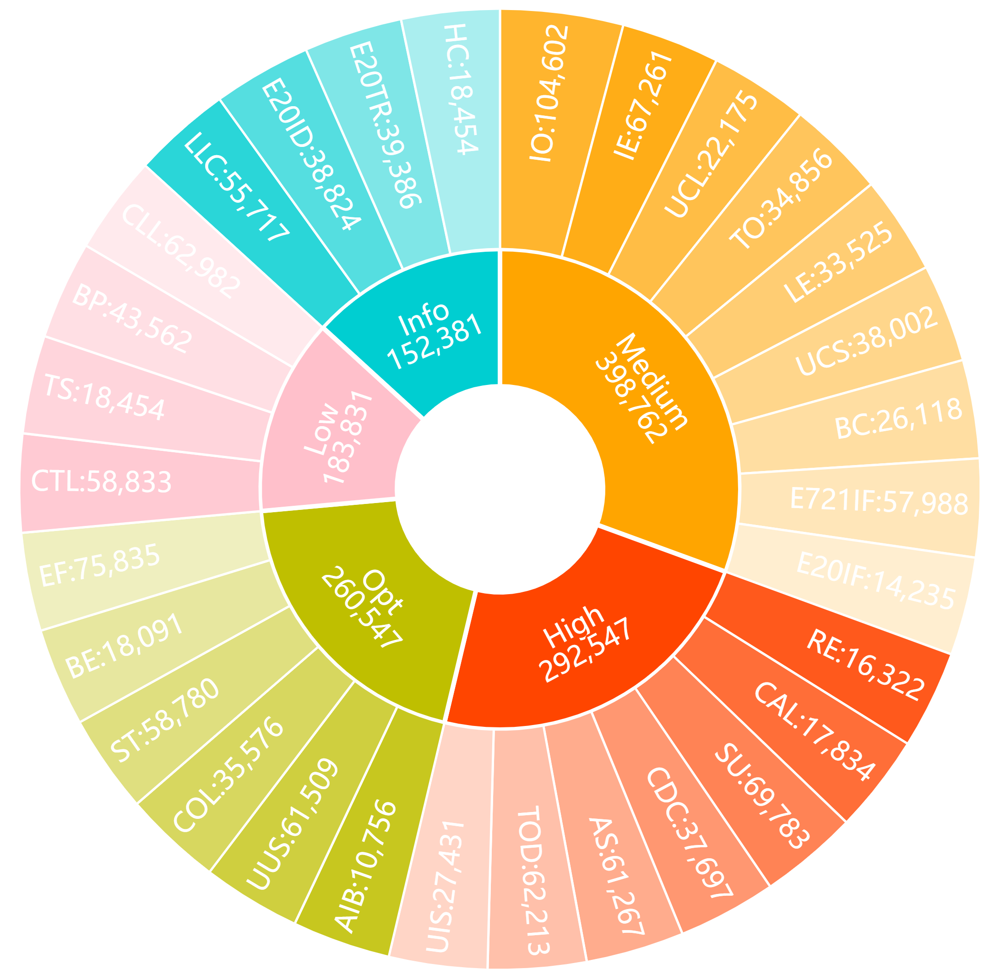

# Detection_result

The folder "Detection_result" describes the detection result of each method in detail.

## results_all_sample_10000.xlsx

The file "results_all_sample_10000.xlsx" describes the number of each vulnerability that each method detects on sampled contracts. Also, it counts the corresponding detection situation according to the vulnerabilities' severity.

## Result of VulHunter on all contracts in Dataset_4

    
     
    
Fig. The number of vulnerabilities detected by VulHunter on Dataset_4.	

Due to the expansive time overhead in other methods such as Mythril and Oyente, we randomly sampled and detected 10,000 bytecodes from the Dataset\_4, and all of the 183,710 bytecodes were identified only by VulHunter. The above figure shows the detection results of VulHunter on these contracts. It indicates similar facts with experiments on Dateset\_3, that is, many contracts with problems that need further improvement. 