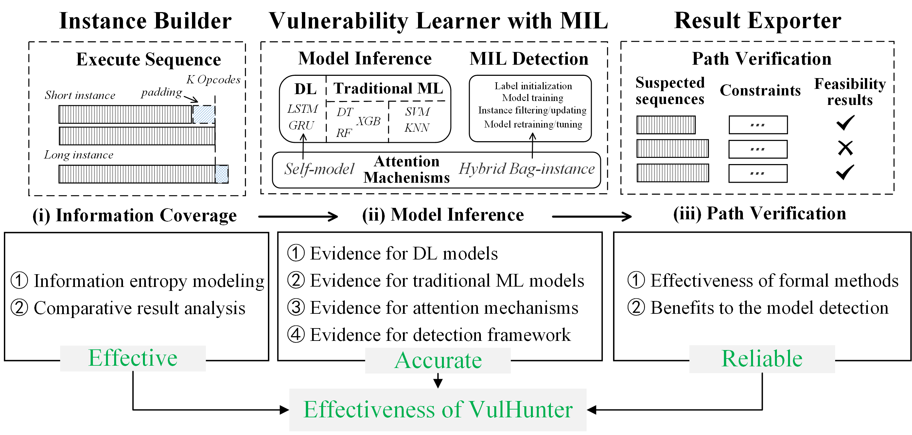
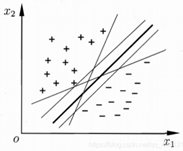
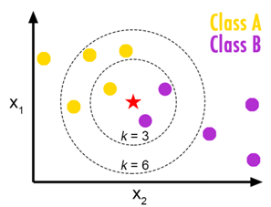
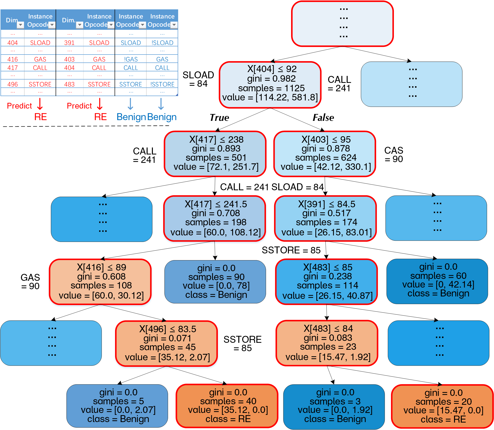
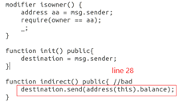
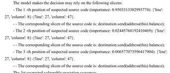

# Theoretical analysis of effectiveness



As shown in the above figure, we deliver the following three steps to illustrate the effectiveness insights of VulHunter in theory, i.e., effective information coverage, accurate model inference, and reliable path verification.

## Effective information coverage

In order to demonstrate the effective coverage of the semantic information of VulHunter, we develop a theoretical analysis framework, i.e., instance/path recording entropy model, to analyze the information preserved in the process of VulHunter for opcode sequences-based contract instance analysis. 

### Information entropy modeling

The developed framework aims to quantitatively evaluate the information retained by the exiting instance recording modes, which decide the data representations for malicious instance detection, by using three metrics: (i) the amount of information, i.e., the average Shannon entropy obtained by recording one opcode operation; (ii) the scale of data, i.e., the space used to store the information; (iii) the density of information, i.e., the amount of information on a unit of storage.

At first, this framework models an instance, i.e., a sequence of per-operation features, as a sequence of random variables represented by an aperiodic irreducible discrete-time Markov chain (DTMC) [NDSS_DTMC]. In this way, the useful data information for models can be quantified. Let ${\cal G} = \left\lbrace {\cal V},{\cal E} \right\rbrace$ denote the state diagram of the DTMC, where ${\cal V}$ is the set of states (i.e., the values of the variables) and ${\cal E}$ denotes the edges. We define $s = \left| {\cal V} \right|$ as the number of different states and use ${\cal W} = {[{w_{ij}}]_{s \times s}}$ to denote the weight matrix of ${\cal G}$ . All of the weights are equal and normalized:

$$ \forall {\kern 1pt} 1 \le i,j,m,n \le s,{\kern 1pt} ({w_{ij}} = {w_{mn}}) \vee ({w_{ij}} = 0 \vee {w_{mn}} = 0) $$

$$ {w_i} = \sum\nolimits_{j = 1}^s {{w_{ij}}} ,{\kern 1pt} 1 = \sum\nolimits_{i = 1}^s {{w_i}} $$

The state transition is performed based on the weights, i.e., the transition probability matrix $P=[P_{ij}]_{s \times s}$ and $`P_{ij} = w_{ij} / {w_i}`$ . Therefore, the DTMC has a stationary distribution $\mu$ :

$$ \left\lbrace {\begin{array}{*{20}{c}}
{\mu P = \mu }\\
{1 = \sum\nolimits_{i = 1}^s {{\mu _i}} }
\end{array}} \right. \Rightarrow {\mu _i} = {w_i},{\kern 1pt} \forall {\kern 1pt} 1 \le i \le s $$

Assume that the stationary distribution is a binomial distribution with the parameter: $0.1 \le p \le 0.9$ to approach Gaussian distribution with low skewness:

$$ \mu  \sim B(s,p) \to {\cal N}(sp,sp(1 - p)) $$

Based on the distribution, we obtain the entropy rate of the DTMC, which is the expected Shannon entropy increase for each step in the state transition, i.e., the expected Shannon entropy of each random variable in the sequence, (using nat as unit, 1 *nat* $\approx$ 1.44 *bit*):

$${\cal H}[{\cal G}] = \sum\limits_{i = 1}^s {{\mu_i}\sum\limits_{j = 1}^s {{P_{ij}}\ln \frac{1}{{{P_{ij}}}}} }  = \sum\limits_{i = 1}^s {{w_i}\ln {w_i}}  - \sum\limits_{i = 1}^s {\sum\limits_{j = 1}^s {{w_{ij}}\ln {w_{ij}}} }  = \ln \left| {\cal E} \right| - \frac{1}{2}\ln 2\pi esp(1 - p)$$

Moreover, for the real-world instance size distribution, we assume that the length of the sequence of random variables obeys a geometric distribution with high skewness, i.e., $L \sim G(q)$ with a parameter: $0.5{\rm{ }} \le {\rm{ }}q{\rm{ }} \le {\rm{ }}0.9$ . ${\cal H}$ , ${\cal L}$ , and ${\cal D}$ denote the expectation of the metrics, i.e., the amount of information, the scale of data, and the density, respectively.

Then, by using this framework, we model five types of contract execution sequence (i.e., instance or path) recording mode, including (i) idealized mode that records and stores the whole/all per-operation (opcode) feature sequence, that is, it holds all of the contract instance semantics; (ii) opcode sequences-based contract instance recording mode used by VulHunter, which employs the model parameter T to normalize the instance length for the model input; (iii) event-based mode that records specific events for instances denoted by random variable sequences, and its advantage is that the same instance events are recorded only once; (iv) sampling/summary-based mode that records coarse-grained instance information, i.e., the sum of opcode values; and (v) statistics-based mode (e.g., S-gram [ASE_S-gram] and ContractWard [TNSE_ContractWard]) that records the statistical information of states via several counters. Note that, some graph-based methods such as DeeSCVHunter [IJCNN_DeeSCVHunter] are also applied to statistics-based mode, as they employ embedding tools such as Word2Vec to represent the graph nodes as vectors of state frequency.

#### Idealized Recording Mode

The idealized recording mode has infinite storage and captures optimal fidelity instance information by recording all random variables from the sequence without any processing. In other words, this mode collects all the original information of instances. Thus, the obtained information entropy of the idealized mode grows at the entropy rate of the DTMC:

```math
{{\cal H}_{Ideal}} = E[L{\cal H}[{\cal G}]] = \sum\nolimits_{l = 1}^\infty {{\mathbb{P}[L = l] \cdot l}  \cdot {\cal H}[{\cal G}]} = \frac{1}{q} \cdot {\cal H}[{\cal G}] = \frac{1}{q}ln\left| {\cal E} \right| - \frac{1}{{2q}}\ln 2\pi esp(1 - p)
```

According to data processing inequality [TIT_Inequality], the information retained in the idealized recording mode reaches the optimal value. Also, we can obtain the scale of data and the density of information for the idealized recording mode as follows:

```math
{{\cal L}_{Ideal}} = E[L] = \sum\nolimits_{l = 1}^\infty  {\mathbb{P}[L = l] \cdot l}  = \sum\nolimits_{l = 1}^\infty  {q{{(1 - q)}^{l - 1}} \cdot l}  = \frac{1}{q}
```
```math
{{\cal D}_{Ideal}} = \frac{{{{\cal H}_{Ideal}}}}{{{{\cal L}_{Ideal}}}} = {\cal H}[{\cal G}] = \ln \left| {\cal E} \right| - \frac{1}{2}\ln 2\pi esp(1 - p)
```

#### Opcode sequences-based Recording Mode of VulHunter

VulHunter applies different recording strategies for short and long instances, i.e., when $L > T$ it maintains the *K* operation features given the unified instance lengths for models, and when $L \le T$ it records detailed per-operation features. Let $`{{\cal X}_{{\rm{V}}{\rm{.H}}{\rm{.}}}}`$ denote the random set of the recorded information. For short instances, all the random variables are collected in $`{{\cal X}_{{\rm{V}}{\rm{.H}}{\rm{.}}}}`$ . For long instances, $`{{\cal X}_{{\rm{V}}{\rm{.H}}{\rm{.}}}}`$ collects the first *T* opcodes of them. First, we decompose the entropy of the opcode sequence-based recording mode as the terms for short and long instances:

```math
{{\cal H}_{{\rm{V}}{\rm{.H}}{\rm{.}}}} = {\cal H}[{{\cal X}_{{\rm{V}}{\rm{.H}}{\rm{.}}}}|L] = \sum\nolimits_{l = 1}^\infty  {\mathbb{P}[L = l]}  \cdot {\cal H}[{{\cal X}_{{\rm{V}}{\rm{.H}}{\rm{.}}}}|L = l] = {\cal H}[{\cal X}_{{\rm{V}}{\rm{.H}}{\rm{.}}}^S|L] + {\cal H}[{\cal X}_{{\rm{V}}{\rm{.H}}{\rm{.}}}^L|L]
```
```math
\left\lbrace {\begin{array}{*{20}{c}}
{{\cal H}[{\cal X}_{{\rm{V}}{\rm{.H}}{\rm{.}}}^S|L] = \sum\nolimits_{l = 1}^T {\mathbb{P}[L = l] \cdot {\cal H}[{{\cal X}_{{\rm{V}}{\rm{.H}}{\rm{.}}}}|L = l]} }\\
{{\cal H}[{\cal X}_{{\rm{V}}{\rm{.H}}{\rm{.}}}^L|L] = \sum\nolimits_{l = T + 1}^\infty  {\mathbb{P}[L = l] \cdot {\cal H}[{{\cal X}_{{\rm{V}}{\rm{.H}}{\rm{.}}}}|L = l]} }
\end{array}} \right.
```

**Short Instance Information.** VulHunter records detailed per-operation feature sequences for short instances which is the same as the lossless recording in the idealized mode. Thus, the increasing rate of information equals the entropy rate of the DTMC:

```math
{\cal H}[{\cal X}_{{\rm{V}}{\rm{.H}}{\rm{.}}}^S|L = l] = l \cdot {\cal H}[{\cal G}]
```
```math
{\cal H}[{\cal X}_{{\rm{V}}{\rm{.H}}{\rm{.}}}^S|L] = \sum\nolimits_{l = 1}^T {\mathbb{P}[L = l] \cdot l \cdot {\cal H}[{\cal G}]}  = {\cal H}[{\cal G}] \cdot q \cdot \sum\nolimits_{l = 1}^T {l \cdot {{(1 - q)}^{l - 1}}}  = \frac{{1 - {\rm{(T}}q + {\rm{1)(1}} - q{{\rm{)}}^T}}}{q} \cdot {\cal H}[{\cal G}]
```

**Long Instance Information.** When $L > T$ , the random set collects the first *T* operations/opcodes and records detailed per-operation feature sequences. In this way, the calculating process of the entropy rate is similar to that of short instances:

```math
{\cal H}[{\cal X}_{{\rm{V}}{\rm{.H}}{\rm{.}}}^L|L = l] = T \cdot {\cal H}[{\cal G}]
```
```math
{\cal H}[{\cal X}_{{\rm{V}}{\rm{.H}}{\rm{.}}}^L|L] = \sum\nolimits_{l = K{\rm{ + }}1}^\infty  {\mathbb{P}[L = l] \cdot {\cal H}[{\cal X}_{{\rm{V}}{\rm{.H}}{\rm{.}}}^L|L = l]}  = \sum\nolimits_{l = T{\rm{ + }}1}^\infty  {q{{{\rm{(1}} - q{\rm{)}}}^{l - {\rm{1}}}} \cdot T \cdot {\cal H}[{\cal G}]}  = T{{\rm{(1}} - q{\rm{)}}^T} \cdot {\cal H}[{\cal G}]
```

Finally, we take $`{\cal H}[{\cal X}_{{\rm{V}}{\rm{.H}}{\rm{.}}}^S|L]`$ and $`{\cal H}[{\cal X}_{{\rm{V}}{\rm{.H}}{\rm{.}}}^L|L]$ in ${{\cal H}_{{\rm{V}}{\rm{.H}}{\rm{.}}}}`$  and complete the analysis for the entropy of the opcode sequence-based recording mode.

```math
{{\cal H}_{{\rm{V}}{\rm{.H}}{\rm{.}}}} = {\cal H}[{\cal X}_{{\rm{V}}{\rm{.H}}{\rm{.}}}^S|L] + {\cal H}[{\cal X}_{{\rm{V}}{\rm{.H}}{\rm{.}}}^L|L] = (\frac{{1 - {\rm{(}}Tq + {\rm{1)(1}} - q{{\rm{)}}^T}}}{q} + T{{\rm{(1}} - q{\rm{)}}^T}) \cdot {\cal H}[{\cal G}] = \frac{{1 - {{{\rm{(1}} - q{\rm{)}}}^T}}}{q} \cdot {\cal H}[{\cal G}]
```

Similarly, we obtain the expected data scale by analyzing the conditions of short and long instances separately:

```math
\begin{array}{c}
{{\cal L}_{{\rm{V}}{\rm{.H}}{\rm{.}}}} = {\mathop{\rm E}\nolimits} [{\cal L}_{{\rm{V}}{\rm{.H}}{\rm{.}}}^S|L] + {\mathop{\rm E}\nolimits} [{\cal L}_{{\rm{V}}{\rm{.H}}{\rm{.}}}^L|L] = \sum\nolimits_{l = 1}^T {\mathbb{P}[L = l] \cdot L}  + \sum\nolimits_{l = T{\rm{ + }}1}^\infty  {\mathbb{P}[L = l] \cdot } T\\
 = \sum\nolimits_{l = 1}^T {q{{(1 - q)}^{l - 1}} \cdot l + } \sum\nolimits_{l = T + 1}^\infty  {q{{(1 - q)}^{l - 1}} \cdot T} {\rm{ = }}\frac{{1 - {\rm{(}}Tq + 1{\rm{)(}}1 - q{{\rm{)}}^T}}}{q} + T{(1 - q)^T} = \frac{{1 - {{{\rm{(}}1 - q{\rm{)}}}^T}}}{q}
\end{array}
```

Also, we obtain the expected information density by its definition: $`{{\cal D}_{{\rm{V}}{\rm{.H}}{\rm{.}}}} = {{{{\cal H}_{{\rm{V}}{\rm{.H}}{\rm{.}}}}} / {{{\cal L}_{{\rm{V}}{\rm{.H}}{\rm{.}}}}}}`$ and complete the analysis for the opcode sequence-based recording mode used by VulHunter.

#### Event-based Mode

Let random variable $`{{\cal X}_{{\rm{Eve,}}}}`$ indicate if the event-based mode records an event for an instance denoted by a random variable sequence, $`\left\langle {s _1,s _2, \ldots ,{s_L}} \right\rangle`$ , where $L \sim G(q)$ . Then, we assume that the mode can merge repetitive events. First, we obtain the probability distribution of the random variable ${{\cal X}_{{\rm{Eve,}}}}$ :

```math
\mathbb{P}[{{\cal X}_{{\rm{Eve,}}}} = 1] = 1 - \mathbb{P}[{{\cal X}_{{\rm{Eve,}}}} = 0]
```
```math
\mathbb{P}[{{\cal X}_{{\rm{Eve,}}}} = 0] = \sum\nolimits_{l = 1}^\infty  {\mathbb{P}[L = l] \cdot \mathbb{P}[{{\cal X}_{{\rm{Eve,}}}} = 0\left| {L = l} \right.]}  = \sum\nolimits_{l = 1}^\infty  {{{(1 - q)}^{l - 1}}}  \cdot q \cdot {(1 - {p^s})^l} = \frac{{q(1 - {p^s})}}{{{p^s} + q(1 - {p^s})}}
```

Then, we obtain the entropy of the random variable $`{{\cal X}_{{\rm{Eve,}}}}`$ :

```math
{{\cal H}_{{\rm{Eve}}{\rm{.}}}} = {\cal H}[{{\cal X}_{{\rm{Eve,}}}}] =  - \mathbb{P}[{{\cal X}_{{\rm{Eve,}}}} = 0]ln\mathbb{P}[{{\cal X}_{{\rm{Eve,}}}} = 0] - \mathbb{P}[{{\cal X}_{{\rm{Eve,}}}} = 1]ln\mathbb{P}[{{\cal X}_{{\rm{Eve,}}}} = 1]
```

We observe that $`\frac{{\partial {\cal H}[{{\cal X}_{{\rm{Eve,}}}}]}}{{\partial q}} \approx 0`$ when $q > 0.5$ . Thus, we use the second-order taylor series of *q* to approach $`{{\cal H}_{{\rm{Eve}}{\rm{.}}}}`$ :

```math
{{\cal H}_{{\rm{Eve}}{\rm{.}}}} = \frac{{2q(1 - {p^s})ln\frac{{q({p^s} - 1)}}{{q({p^s} - 1) - {p^s}}}}}{{q({p^s} - 1) - {p^s}}} =  - 2\theta \ln \theta
```

where $\theta  = \frac{\varsigma }{\eta }$ , $\varsigma  = q({p^s} - 1)$ , and $`\eta  = q({p^s} - 1) - {p^s}`$ . Similarly, we obtain the expected data scale $`{{\cal L}_{{\rm{Eve}}{\rm{.}}}}`$ and the information density $`{{\cal D}_{{\rm{Eve}}{\rm{.}}}}`$  :

```math
{{\cal L}_{{\rm{Eve}}{\rm{.}}}} = \mathbb{P}[{{\cal X}_{{\rm{Eve,}}}} = 1] = \frac{{{p^s}}}{{q(1 - {p^s}) + {p^s}}} =  - \frac{{{p^s}}}{\eta } = \frac{{{p^s}}}{{q(1 - {p^s}) + {p^s}}}$$
$${{\cal D}_{{\rm{Eve}}{\rm{.}}}} = \frac{{{{\cal H}_{{\rm{Eve}}{\rm{.}}}}}}{{{{\cal L}_{{\rm{Eve}}{\rm{.}}}}}} = \frac{{2\varsigma }}{{{p^s}}} \cdot \ln \theta  = \frac{{2q({p^s} - 1)}}{{{p^s}}} \cdot \ln \frac{{q({p^s} - 1)}}{{q({p^s} - 1) - {p^s}}}
```

Here, we complete the analysis for the event-based mode.

#### Sampling-based Mode

We use $`{{\cal X}_{{\rm{Samp}}{\rm{.}}}}`$ to denote the random variable to be recorded as the instance information in the sampling-based mode, which is the sum of the observed per-operation features denoted by the random variable sequence. We can obtain the distribution of $`{{\cal X}_{{\rm{Samp}}{\rm{.}}}}`$ as follows:

```math
{{\cal X}_{{\rm{Samp}}{\rm{.}}}} = \sum\nolimits_{i = 1}^L {{s_i}} ,{\kern 1pt} {s_i} \sim B(s,p) \Rightarrow {{\cal X}_{{\rm{Samp}}{\rm{.}}}} \sim B(Ls,p)
```

The amount of the information recorded by the sampling-based mode is the Shannon entropy of $`{{\cal X}_{{\rm{Samp}}{\rm{.}}}}`$ . We decompose the entropy as conditional entropy and mutual information:

```math
{{\cal H}_{{\rm{Samp}}{\rm{.}}}} = {\cal H}[{{\cal X}_{{\rm{Samp}}{\rm{.}}}}] = {\cal H}[{{\cal X}_{{\rm{Samp}}{\rm{.}}}}\left| L \right.] + \Gamma ({{\cal X}_{{\rm{Samp}}{\rm{.}}}};L)
```

We assume that the mutual information between the sequence length *L* and the accumulative statistic $`{{\cal X}_{{\rm{Samp}}{\rm{.}}}}`$ is close to zero. It implies the impossibility of inferring the statistic from the length of the opcode sequence. Then we obtain a lower bound of the entropy as an estimation, which is verified to be a tight bound via numerical analysis:

```math
{\cal H}[{{\cal X}_{{\rm{Samp}}{\rm{.}}}}|L = l] = \frac{1}{2}\ln 2\pi elsp(1 - p)
```
```math
{{\cal H}_{{\rm{Samp}}{\rm{.}}}} = {\cal H}[{{\cal X}_{{\rm{Samp}}{\rm{.}}}}|L] = \sum\nolimits_{l = 1}^\infty  {\mathbb{P}[L = l] \cdot {\cal H}[{{\cal X}_{{\rm{Samp}}{\rm{.}}}}|L = l]}  = \frac{1}{2}\ln 2\pi esp(1 - p + \frac{q}{2}\sum\nolimits_{l = 1}^\infty  {{{(1 - q)}^{l - 1}}\ln l}
```

We observed that the second-order Taylor series can accurately approach the second term of the entropy:

```math
{{\cal H}_{{\rm{Samp}}{\rm{.}}}} = \frac{1}{2}\ln 2\pi esp(1 - p) + \frac{{\ln 2}}{2}q(1 - q)
```

Finally, we obtain the expected data scale (i.e., the sum of binomially distributed variables) and the information density similar to the analysis for the event-based mode and complete the analysis for the sampling-based mode. 

```math
{{\cal L}_{{\rm{Samp}}{\rm{.}}}} = 1
```
```math
{{\cal D}_{{\rm{Samp}}{\rm{.}}}} = \frac{{{{\cal H}_{{\rm{Samp}}{\rm{.}}}}}}{{{{\cal L}_{{\rm{Samp}}{\rm{.}}}}}} = {{\cal H}_{{\rm{Samp}}{\rm{.}}}} = \frac{1}{2}\ln 2\pi esp(1 - p) + \frac{{\ln 2}}{2}q(1 - q)
```

#### Statistics-based Mode

We use $`{{\cal X}_{{\rm{Stat}}{\rm{.}}}}`$ to denote the random set that collects the counters for distribution fitting. When the DTMC has s states, the histogram has s counters $`{v_1},{v_2}, \ldots ,{v_s}`$ , i.e., $`{{\cal X}_{{\rm{Stat}}{\rm{.}}}} = \left\{ {{v_1},{v_2}, \ldots ,{v_s}} \right\}`$ . We assume that the counters are independent: ${v_i} = \sum\nolimits_{j = 1}^L {{\delta _j}}$ and 

```math
{\delta _j} = \left\lbrace {\begin{array}{*{20}{c}}
{1,{\kern 1pt} {\kern 1pt} {\kern 1pt} {\kern 1pt} {\kern 1pt} {\kern 1pt} {\rm{if}}{\kern 1pt} {s_j}{\kern 1pt} {\kern 1pt} {\rm{is}}{\kern 1pt} {\kern 1pt} {\kern 1pt} {\kern 1pt} {\kern 1pt} {\rm{the}}{\kern 1pt} {\kern 1pt} {\kern 1pt} {\kern 1pt} {\kern 1pt} {i^{{\rm{th}}}}{\kern 1pt} {\kern 1pt} {\kern 1pt} {\rm{state}}}\\
{0,{\kern 1pt} {\kern 1pt} {\kern 1pt} {\kern 1pt} {\kern 1pt} {\rm{else}}{\rm{.                     }}}
\end{array}} \right.
```

We observe that $`\left\lbrace {{v_1},{v_2}, \ldots ,{v_s}} \right\rbrace`$ is a binomial process:

```math
\begin{array}{c}
{v_i} \sim B(L,\mathbb{P}[{s_i} = i])\\
 \sim B(L,C_s^i{p^i}{(1 - p)^{s - i}})
\end{array}
```

To obtain the closed-form solution, we use as $`\frac{{{{(sp)}^i}{e^{ - sp}}}}{{i!}}`$ an estimation of $`C_s^i{p^i}{(1 - p)^{s - i}}`$ . Moreover, the length of the long instance is relatively large, which implies $`{v_i}`$ approaches a Poisson distribution:

```math
\begin{array}{c}
{v_i} \sim \pi (L,\mathbb{P}[{s_i} = i])\\
 \sim \pi ({\lambda _i}),{\kern 1pt} {\kern 1pt} {\kern 1pt} {\kern 1pt} {\kern 1pt} {\lambda _i} = \frac{{{{(sp)}^i}{e^{ - sp}}}}{{i!}}
\end{array}
```

Based on the distribution of the collected counters, we obtain the entropy of the random set:

```math
{\cal H}[{{\cal X}_{{\rm{Stat}}{\rm{.}}}}|L = l] = \sum\nolimits_{i = 1}^s {{\cal H}[{v_i}|L = l]}  = \sum\nolimits_{i = 1}^s {\frac{1}{2}\ln 2\pi el} \frac{{{{(sp)}^i}{e^{ - sp}}}}{{i!}}
```
```math
\begin{array}{c}
{\cal H}[{{\cal X}_{{\rm{Stat}}{\rm{.}}}}|L] = \sum\nolimits_{l = 1}^\infty  {\mathbb{P}[L = l] \cdot {\cal H}[{{\cal X}_{{\rm{Stat}}{\rm{.}}}}|L = l]}  = \sum\nolimits_{l = 1}^\infty  {q{{(1 - q)}^{l - 1}}}  \cdot \sum\nolimits_{i = 1}^s {\frac{1}{2}\ln 2\pi el} \frac{{{{(sp)}^i}{e^{ - sp}}}}{{i!}}\\
{\kern 1pt} {\kern 1pt} {\kern 1pt} {\kern 1pt} {\kern 1pt}  = \frac{1}{2}[s\ln 2\pi e + \frac{{s{\rm{(}}s + 1{\rm{)}}}}{2}\ln sp - {s^2}p - \sum\nolimits_{i = 1}^s {\ln i!} ] + \frac{{qs}}{2}[\sum\nolimits_{l = 1}^\infty  {{{{\rm{(}}1 - q{\rm{)}}}^{l - 1}}\ln l} ]
\end{array}
```

The assumption of $q > 0.5$ implies $`{K^{{\rm{th}}}}`$ order Taylor series can accurately approach the last term in the above equation. Moreover, we utilize the quadric term of *s* in the Taylor series of $`\sum\nolimits_{i = 1}^s {\ln i!}`$ to approach the entropy of long instances ( $\gamma$  is Euler–Mascheroni constant):

```math
{{\cal H}_{{\rm{Stat}}{\rm{.}}}} = \frac{s}{4}[2\ln 2\pi e + {\rm{(}}s + 1{\rm{)}}\ln sp + 2q\ln K - 2s(1 + p + \gamma )] + \frac{{qs}}{2}[\sum\nolimits_{l = 1}^K {{{{\rm{(}}1 - q{\rm{)}}}^{l - 1}}\ln l} ]
```

Then, we obtain the expected data scale (i.e., the sum of the Poisson distributed variables), which is similar to that of the sampling mode:

```math
{{\cal L}_{{\rm{Stat}}{\rm{.}}}} = 1
```

Also, we obtain the expected information density by its definition: $`{{\cal D}_{{\rm{Stat}}{\rm{.}}}} = {{{{\cal H}_{{\rm{Stat}}{\rm{.}}}}} / {{{\cal L}_{{\rm{Stat}}{\rm{.}}}}}}`$ and complete the analysis for the statistics-based recording mode.

### Comparative result analysis

We perform numerical studies to compare the instance recording modes in real-world settings. We select the opcode value as the per-operation feature, then we measure the parameters of the DTMC, i.e., $`\left| {\cal V} \right| = 135`$ and $`\left| {\cal E} \right| = 3777`$ according to the instances of contracts (total of 222,310) in Dataset_1 and Dataset_4. We also choose *K=512* and estimate the geometric distribution parameter *q* via the second moment. The following three key results can be concluded.


1. **VulHunter maintains more information using the opcode sequences of instances than other modes.** The above sub-figure (a) shows the results on the feasible region ( $`{{\cal F}_{{\rm{Stat}}{\rm{.}}}} = \lbrace 0.1 \le p \le 0.9,0.5 \le q \le 0.9
brace`$ ). We observe that VulHunter maintains at least 1.5~3 times the information entropy than instance recording modes based on the sampling and statistics, and far overweigh the event-based mode. Also, the more long instances (i.e., the lower value of the geometric distribution parameter *q*), the more obvious the gap. Thus, the opcode sequences-based mode can retain high-fidelity instance interaction information. 

2. **VulHunter maintains near-optimal information using opcode sequences.** According to the sub-figure (a), we observe that the information maintained by the sequence is almost equal to the theoretical optimum, with the difference ranging from $5.60 \times {10^{ - 14}}$ to $6.80 \times {10^{ - 4}}$  *nat*. When the parameter *q* approaches 0.5, the instance information loss is relatively larger, given the increasing ratio of long instances that incur more information loss. To reduce the loss, we employ a large length parameter *T=512* to cover as many operation semantics as possible. Nevertheless, the larger the value of *T*, the less operation loss, which enables the model to achieve better performance without overfitting, as shown in the experiment results of Section 4.7.

3. **VulHunter has higher information density than other recording modes.** The sub-figure (c) shows that VulHunter equipped with the opcode sequence-based mode realizes a superior information density than others, e.g., more than 1.2 and 2 times that of modes based on statistics and sampling, respectively. Although the idealized system realizes the optimal amount of contract execution information, the density is lower than VulHunter, especially for cases where there are multiple longer instances (i.e., smaller *q*), as shown in the sub-figure (d). It can be attributed to the different recording strategies for short and long instances, and VulHunter extracts the first *K* opcodes of long instances to restrict instance length and reduce the data scale while maintaining as many instance semantics as possible. Also, the uniform instance length is the key to input the model.

> In summary, the instances in the form of opcode sequences detected in VulHunter provide high-fidelity and compact contract execution information, which ensures that the model observes as complete semantics as possible and has enough basis to identify the malicious opcode execution fragments during its reasoning process. However, due to the incomprehensibility of EVM opcodes/bytecodes for the contract developers and auditors, it is still challenging to manually audit and find out the cause of vulnerabilities based on the vast number/volume of normal and vulnerable instances. The emergence of ML-based models provides feasible solutions. In the following contents, we will explain the reasons why the model can automatically and effectively utilize these instance semantics.

## Accurate model inference

We demonstrate the reasoning effectiveness of DL (Deep Learning) and traditional ML (Machine Learning) models from their design goals, realization principles, and mathematical theories. Then, we illustrate the motivations of model attention to provide evidence for the effectiveness of our method. Finally, we explain the overall effectiveness of the detection framework based on the Multiple-instance learning (MIL) mechanism. In the following contents, we will explain their effectiveness in theory one by one.

### Effectiveness evidence for DL models

Due to the generality and extensibility framework of VulHunter, he can employ the DL networks (e.g., Recurrent Neural Network and Convolutional Neural Network) and traditional ML models (e.g., Random Forest and Support Vector Machine) to further improve the detection performance, which is discussed in Section 4.6. In this section, we first explain the effectiveness of mainly used DL models, i.e., Recurrent Neural Network and Convolutional Neural Network, given their superior fitting ability compared to traditional ML models.

Neural networks feel like a bionic approach and are regarded as simulations of the nervous system in animal brains. From a mathematical perspective, a multi-layer neural network is essentially a composite function. The Universal Approximation Theorem demonstrates the fitting ability of neural networks, which is similar to the polynomial approximation. Specifically, it explains that neural networks have a kind of universality, i.e. no matter what mapping function ${\rm f} (x)$ for any finite measurable partition of ${I_n}$ is, there is a network with at least 1 hidden layer (a finite number of weights) that can approximately approach the function [Universal_Approximation_Theorem, Universal_Approximators, Sigmoidal]. That is, let $C(\mathbb{R}^n,\mathbb{R}^m)$ denote the set of functions from a subset of a Euclidean $\mathbb{R}^n$ space to a Euclidean space $\mathbb{R}^m$   ( $n,m \in  \mathbb{N}$ ). Let $\varphi  \in C(\mathbb{R},\mathbb{R})$ , and $\varphi  \circ x$  denotes $\varphi$ applied to each component of *x*. For any $\varepsilon  > 0$  , *n*, *m*, and  $\varphi$ , there exist $k \in \mathbb{N}$ ,  $A \in {\mathbb{R}^{k \times n}}$  ,  $b \in {\mathbb{R}^k}$  ,  and $V \in {\mathbb{R}^{m \times k}}$ , such that

$$\forall x \in {I_n}  ,  {\mathop{\rm F}\nolimits} (x) = V \cdot (\varphi  \circ (A \cdot x + b)) , \left| {{\mathop{\rm F}\nolimits} (x) - {\mathop{\rm f}\nolimits} (x)} \right| < \varepsilon $$

where ${\mathop{\rm F}\nolimits} (x)$ is the neural network mapping function. This theorem aims to construct this function that approximates any function defined in finite measurable partition space with arbitrarily specified precision. The case of $\varphi  \in C(\mathbb{R},\mathbb{R})$ using the sigmoid activation function has been demonstrated in [Sigmoidal]. Also, the universal approximation property is guaranteed by the structure of neural networks, which can endow networks with superior fitting capabilities [Universal_Approximation_Theorem].

#### Recurrent neural networks (RNNs)

RNNs are essentially fully connected neural networks with weight sharing, so the universal approximation theorem is applicable to them. Also, as explained in Section 3.5, they connect neurons in the hidden layer through hidden states $\overrightarrow {{h_t}}$  / $\overleftarrow {{h_t}}$ , enabling them to consider front/back temporal relationships and better handle timing-related tasks such as semantics understanding. Notably, the contract sequence analysis is similar to the text semantic recognition, and the linear execution of the contract code makes the context connection in the execution path, such as the creation, assignment, and destruction of variables, as well as the *if* judgments and *for* loops. RNNs can consider underlying contextual relationships of the opcodes in contract execution sequences, i.e., considering the future and past contexts. Since it is cumbersome and time-consuming to manually parse the execution sequence and discover the possible vulnerability-related semantic connections between the opcode execution sequences, automatically fitting the relationship through the neural networks may be a good choice.

Furthermore, models such as Bi-LSTM and Bi-GRU, as identification engines in our framework, employ the gating mechanism such as forget, reset, and update gates to filter and add the long-term and short-term memory of the neuron unit. This process aims to simulate the thinking of the expert’s brain, thereby considering the semantic information in the contract execution paths. The good experiment results of them in Section 4.6 can illustrate the benefits of these unique designs.

#### Convolutional Neural Networks (CNNs)

The universal approximation theorem is also applied to CNNs. In particular, the convolutional and pooling layers of CNN have unique characteristics. In [CNN_Prove], CNN is viewed as a cascade of linearly weighted filters and non-linear functions for scattering data. That is, convolutional operations in CNN are divided into two steps. The first step involves linear transformations, projecting the data linearly into a lower-dimensional space. The second step entails activation function transformations, which perform non-linear compression on the data. More importantly, the authors elucidate its modeling capabilities from a mathematical perspective by analyzing the contraction and separation properties of filters and functions. Thus, the valuable data information can be fitted and represented by the networks, enabling models to make correct decisions.

### Effectiveness evidence for attention mechanisms

Based on the models, VulHunter leverages Bag-instance and self-model attentions to catch the salient instance fragments and consider both bag (contract) and instance learning effects. Among it, the self-model attention is used to generate the importance distribution of opcodes and obtain the critical opcode fragments, thereby mapping the defective contract source statements. On the other hand, it improves the perception ability of the model and enables it to handle the inputs of long instances without vanishing gradients and overfitting. Specifically, as described in Section 3.5, the sequence representation $r = H{\alpha ^ * }$ is formed by a weighted sum of output vector $H = \left[ {{h_1},{h_2}, \cdots ,{h_T}} \right]$ , and the attention weight $\alpha$ is calculated by ${\rm{softmax}}({w^ * }\tan (H))$ . In this way, the model can concentrate on the more important inputs, so as to improve its detection accuracy. Additionally, we can obtain the critical input fragments according to the attention weights.

The second Bag-instance hybrid attention is designed to train the model under the guidance of both contract and instance labels. As discussed in Section 5.1, the model can adjust its prediction direction based on the contract true labels, so that it can be continuously optimized (i.e., a declining loss) during the iterative optimization process to steadily improve the recall rate and maintain a superior accuracy rate. For instance, this attention can notify the model to adjust its judgments by imposing a loss penalty when it misses the malicious instances in vulnerable contracts or misreports malicious instances in benign contracts, so as to make it correct the detection result in time. Furthermore, as shown in Fig. 10, the increased metrics of VulHunter portray that the model indeed gradually learns the critical instance features of benign and malicious contracts under the guidance of this attention.

In total, the application of the attention mechanism is useful for improving the interpretability and detection ability (e.g., accuracy and recall, as well as the robustness for unpredictable instance disturbances) of the method on the basis of automatic model fitting. Of course, there are some attention methods in the emerging sequence models such as transformer [Transformer] and Bert [Bert], and we will explore them in the future, thereby making the effectiveness of our model more traceable.

### Effectiveness evidence for traditional ML models

In this section, we continue to demonstrate the effectiveness of traditional machine learning models through their inherent interpretability, such as adequate mathematical foundations. Based on the type of interpretability, traditional ML methods can be divided into two categories, namely, mathematical theories-based and rules-based.

#### Mathematical theories-based ML

This type of algorithm is designed and realized by a series of operations based on mathematical theories, such as linear regression and naive Bayes. Among baseline models employed in Section 4.6, Support Vector Machine and K-Nearest Neighbor are examples of this type. **Support Vector Machine (SVM).** SVM is a set of supervised learning methods, which can solve linear and non-linear problems and work well for many practical tasks, such as classification, regression, and outlier detection. It creates a line or a hyperplane that separates the data into classes. Specifically, as shown in the below figure, the two-dimensional plane is divided into multiple regions by several lines. 



Similarly, in a higher *n*-dimensional space, there still exist lines represented by the equation ${w_1}{x_1} + {w_2}{x_2} +  \cdots  + {w_n}{x_n} + b$ that can separate two classes of sample points, which are also known as hyperplanes. Expressing parameters ${w_1} \sim {w_n}$ and variables ${x_1} \sim {x_n}$ as vectors, the equation of the hyperplane can be simplified to $L:{w^T}X + b = 0$ . In this way, two-class samples ${X_i}$ and their labels ${y_i}$  ( $i \in [1,k]$ ) satisfy the following inequality.

$$\left\lbrace {\begin{array}{*{20}{c}}
{{w^T}{X_i} + b \ge 1{\kern 1pt} {\kern 1pt} {\kern 1pt} {\kern 1pt} {\kern 1pt} {\kern 1pt} {\kern 1pt} {\kern 1pt} {\kern 1pt} {\kern 1pt} {\kern 1pt} {\kern 1pt} {\kern 1pt} {\kern 1pt} {\kern 1pt} {\kern 1pt} {y_i} =  + 1}\\
{{w^T}{X_i} + b \le  - 1{\kern 1pt} {\kern 1pt} {\kern 1pt} {\kern 1pt} {\kern 1pt} {\kern 1pt} {\kern 1pt} {\kern 1pt} {y_i} =  - 1}
\end{array}} \right.$$

Also, the distance *d*  from the sample/support vector ${X_i}$ to the hyperplane can be expressed as:

$$d = \frac{{\left| {{w_1}{x_1} + {w_2}{x_2} +  \cdots  + {w_n}{x_n} + b} \right|}}{{\sqrt {w_1^2 + w_w^2 +  \cdots  + w_n^2} }} = \frac{{\left| {{w^T} + b} \right|}}{{\left\| w \right\|}}$$

In particular, when the sum of distances from two support vectors of different classes to the hyperplane is equal to $d = \frac{2}{{\left\| w \right\|}}$ , the above inequality can take the equality. The optimization goal of SVM is to select the hyperplane that maximizes the interval, i.e., minimizing $\left\| w \right\|$ while satisfying the constraint condition ${y_i}\left| {{w^T} + b} \right| \ge 1$  . Furthermore, SVM can describe nonlinear hyperplanes and handle linearly inseparable datasets by using kernel functions such as polynomial, Gaussian, and Laplacian. Note that this process can also be explained by a series of mathematical reasoning [SVM_Prover]. That is, it is interpretable.

**K-Nearest Neighbor (KNN).** KNN is also a popular ML technique used for classification and regression tasks. It relies on the idea that similar data points tend to have similar labels or values. Specifically, the class of a sample is the same as the majority of the *K* most similar samples in the feature space. For example, for the following example, when *K* is defined as 3, the class of the pentagon is B as it is the majority category of the nearest 3 points. While the category of the pentagon becomes A when *K* is defined as 6.



In this algorithm, the similarity between samples is determined by distance measurement algorithms, such as Euclidean distance ${d_{{\rm{Eucl}}}}$ , Manhattan distance ${d_{{\rm{Manh}}}}$  , Chebyshev distance ${d_{{\rm{Cheb}}}}$ , Minkowski distance ${d_{{\rm{Mink}}}}$  . For example, for samples ${x_1} = \left( {x_1^1,x_1^2, \cdots ,x_1^n} \right)$ and ${x_2} = \left( {x_2^1,x_2^2, \cdots ,x_2^n} \right)$ ( $n \in {\mathbb{Z}^ + }$ ), their distances are defined as follows:

$${d_{{\rm{Eucl}}}} = \sqrt {\sum\nolimits_{i = 1}^n {{{\left( {x_1^i - x_2^i} \right)}^2}} } , {d_{{\rm{Manh}}}} = \sum\nolimits_{i = 1}^n {\left| {x_1^i - x_2^i} \right|} , {d_{{\rm{Cheb}}}} = \mathop {\max }\limits_{i \in [1,n]} \left( {x_1^i - x_2^i} \right), {d_{{\rm{Mink}}}} = \sqrt[p]{{\sum\nolimits_{i = 1}^n {{{\left| {x_1^i - x_2^i} \right|}^p}} }}$$

Therefore, this algorithm is similar to the clustering method, i.e., there is a close relationship exists between samples of the same class. Since the category of a sample is determined by *K* nearest known samples, the probability $P({\mathop{\rm f}\nolimits} (z) \ne {y_z})$ of sample *z* being misclassified is minimized, where ${\mathop{\rm f}\nolimits} (z)$  is the classification function.

$$P({\mathop{\rm f}\nolimits} (z) \ne {y_z}) = 1 - P({\mathop{\rm f}\nolimits} (z) = {y_z}) = \frac{1}{k}\sum\limits_{{x_i} \in {N_k}(z)} {{\mathop{\rm I}\nolimits} ({y_i} \ne {y_z})}  = 1 - \frac{1}{k}\sum\limits_{{x_i} \in {N_k}(z)} {{\mathop{\rm I}\nolimits} ({y_i} = {y_z})} $$

#### Rules-based ML

This algorithm generates rules to represent the model trained on the dataset. Decision trees, random forests, and Extreme Gradient Boosting (XGBoost) are examples of this type. **Decision tree (DT).** Among them, a decision tree can be regarded as a rule collection in the form of a tree-like structure, such as the example shown in the below figure. There is no doubt that these models of this type perform well in terms of interpretability, due to they resemble human thinking patterns and are easy to understand [SVM_Rule]. Notably, unlike traditional expert-defined rules, these tree-like rules are generated automatically based on contract instances from the dataset. Especially for the vulnerabilities with unobvious features, it is challenging to manually formulate the corresponding rules. In such cases, using a model to automatically characterize contract vulnerabilities can effectively inspire us to grasp the underlying causes of vulnerabilities and maintain detection patterns [ML_Rules]. Additionally, some algorithms based on statistical theory are also used in decision trees, such as ID3 (Information Gain), CART (Gini index), and C4.5 (Gain ratio), thereby minimizing the weighted entropy sum of all nodes to make the tree more accurate. 

$$C(T){\rm{ = }}\sum\limits_{t \in leaf} {{N_t} * H(t)} $$

Among them, ${N_t}$ is the number of samples in leaf nodes, i.e., the weight of the leaf node.

**Random forest (RF).** In order to address the issue of overfitting in decision trees, the random forest performs multiple bootstrap sampling on the input data, builds several CART decision trees, and finally synthesizes the results of these trees to make classification decisions. In this way, it can achieve more accurate judgments and avoid the impact of wrong decision conditions learned from a single tree. As proved in [RF], with the training sample size increases, the generalization error of random forests will converge, which can be considered the average distance between predicted and actual values. In Experiment 5 of the paper, we trained a random forest model based on the normal and reentrancy vulnerability contract training in Dataset_1. The below figure depicts a segment of the first CART decision tree in this random forest model. It can be seen that the logic representation of the decision tree is similar to the human-defined rules, which can automatically distinguish normal and malicious contracts by checking various feature dimensions based on contract instances. Furthermore, taking instances of the Dao vulnerability event contract in Experiment 7 as an example, through successive dimension judgments, we can identify two instances with reentrancy vulnerability features, i.e., “...SLOAD, ..., GAS, CALL, ..., SSTORE, ...”. However, other rule/logic-based detection methods (e.g., Mythril and SMARTIAN) missed them. Besides, when these features are not met, e.g., there is no GAS instruction before the CALL instruction (i.e., the TRANSFER operation) or no SSTORE instruction after it (i.e., the storage variable is not changed), the decision tree can accurately identify them as normal instances. Note that these rules generated by trees can help existing tools establish/repair their detection logic for new/existing vulnerability patterns and even formulate corresponding repair measures for vulnerabilities.



**eXtreme Gradient Boosting (XGBoost).** XGBoost is also composed of multiple CART decision trees and can be used to handle classification and regression problems. Its final prediction result ${\hat y_i}$  is denoted as $`{\hat y_i}{\rm{ = }}\sum\nolimits_{k = 1}^K {{f_k}({x_i})}`$ , where *K* is the number of decision trees and ${f_k}$  represents a function (an abstract structure of trees) in the mapping space ${\cal F}$ . The objective function is defined as $`{\mathop{\rm obj}\nolimits} (\theta ) = \sum\nolimits_{i = 1}^N {l({y_i},{{\hat y}_i})}  + \sum\nolimits_{i = 1}^K {\Omega ({f_k})}$  and $\Omega ({f_k}) = \gamma T + \frac{1}{2}\lambda \sum\nolimits_{j = 1}^T {w_j^w}`$  . Among them, $l$ , $\Omega$ , $N$ , and  $T$ are the loss function (e.g., MSE), penalty term, number of samples, and number of leaf nodes, respectively. Notably, in addition to the interpretability of trees, this method still has a series of optimizations based on mathematical theory. For instance, compared with traditional Gradient Boosting algorithms, it utilizes the second-order Taylor expansion to combine the second derivative of the loss function with the first derivative, thereby approaching the optimal solution faster. Therefore, this method is sufficiently interpretable.

### Effectiveness evidence for detection framework

As explained above, baseline models can acquire valuable information from contract instances and perform effective inference. In this section, we further illustrate that the detection framework based on MIL can maintain the effectiveness of information and model, i.e., the effectiveness of the detection framework. Specifically, in theory, the framework effectiveness of VulHunter is associated with that of MIL, which has been demonstrated by its wide spectrum of applications, such as computer vision, natural language processing, and biometrics [TPAMI_MILIS]. Also, some arts [AAAI_LossMIL, ICML_Attention] combine theorems to analyze the effectiveness of MIL theoretically, and it mainly relies on the premise that a positive bag contains at least one positive instance, whereas a negative bag includes only negative instances. Nevertheless, for contract analysis, this premise retains exceptional cases. That is, against the contract defects caused by multiple instances, the absence of cooperation instances may make the benign contract contain some critical malicious instances, resulting in false positives. To this end, as discussed above, the Bag-instance hybrid attention can be utilized to allow the model to observe this nuance, thereby delivering an accurate decision. 

## Reliable path verification

As detailed in Section 3.7, a constraint-solving module was designed to build the accumulating constraints of instances and verify its feasibility, which fuses ML with traditional analysis techniques (i.e., symbolic execution). On the one hand, as experimented in Section 4.9, this module can correct some misreports of ML models, thereby improving the accuracy of detection results and guaranteeing the reliability of the results to a certain extent. On the other hand, VulHunter can help symbolic executors [CCS_Making, ASE_Manticore] alleviate the path explosion problem given its fast model inference process. In turn, the symbolic execution method can enhance the overall interpretability of our approach, as the traditional formal analysis method is based on a rigorous mathematical foundation (e.g., Satisfiability Modulo Theories) and entirely interpretable.

## Conclusion of the theoretical analysis

> **In conclusion, VulHunter holds evidence-based effectiveness in terms of instance information extraction, model inference, contract overall detection, and result feasibility verification.**

# Empirical evidence of effectiveness

In this section, we combine the experiment results, including the performance evaluation and example visualization research in Section 4, to demonstrate the theoretical analysis. 

At first, as shown in Tables 6~8, VulHunter can analyze both source code and bytecode accurately and detect most vulnerabilities such as *controlled-delegatecall* and *timestamp* without manual pre-defined rules, which overperform other methods based on ML and traditional formal analysis. This fact reflects the model can indeed obtain the valuable instance information and learn the underlying features of vulnerable/normal contracts given its special data fitting and front/back temporal correlation ability. Also, the superior results demonstrate that ML hold can automatically consider the complex representations caused by vulnerability evolution and compiler updates, especially for bytecode-only detection. This is one of the reasons why we used ML models rather than traditional detection logic.

Second, examples of wild and vulnerability security incident contracts shown in Tables 11 and 12 illustrate that VulHunter can identify contracts that are misreported and underreported by other traditional analysis and ML-based methods, which can reflect the effectiveness and advancement of the overall approach.

Third, as detailed in Section 4.8, compared with the existing ML-based methods such as TMP [IJCAI_GNN], VulHunter can automatically output the vulnerable contract instances and locate the defective source statements and bytecode fragments. This can be attributed to that the detection framework with the MIL mechanism enables VulHunter to deliver the bytecode-level detection, and the self-model attention visualizes the importance distribution of instance inputs while improving the model inference effect. Furthermore, the visualization examples shown in Fig. 8 demonstrate that VulHunter can accurately identify the defective opcode/bytecode fragments and the corresponding source statements. For instance, the reentrant CALL instruction and statement “msg.sender.call.value” can be discovered in the Dao vulnerability incident contract. Also, the statement “destination.send(address(this).balance)” was accurately identified with an *arbitrary-send* vulnerability in the blow contract example.

<div align='center'> </div>

Fourth, as shown in Table 13, VulHunter can employ multiple DL (e.g., GRU and CNN) and traditional ML (e.g., RF and SVM) models as its detectors and achieve satisfactory performance with acceptable standard deviations, which demonstrates the effectiveness of model inference, attention mechanism, and detection framework. Also, it shows that the variety of supervised baseline models bestows VulHunter with diverse detection characteristics, allowing it to meet the different requirements of contract auditors, e.g., discovering more vulnerabilities and producing fewer misreports. This can also confirm that the individual models have different characteristics, e.g., neural network models have better fitting abilities than traditional ML models, making VulHunter hold better overall performance. RF achieves a lower false positive rate than DT, given its multiple bootstrap sampling and integrated voting mechanisms.

Fifth, as depicted in Fig. 9 and Table 16, VulHunter fuses ML and symbolic execution technology to develop a constraint-solving module, which can be used to automatically construct the constraints of vulnerable paths and verify their feasibility, thereby eliminating the false discoveries and guaranteeing the reliability of detection results. Also, the constraint-solving module makes methods such as VulHunter and Oyente hold more capabilities, e.g., obtaining the inputs that restore the vulnerable execution paths. These advantages cannot be achieved by static analysis methods (e.g., pattern matching and pattern analysis) and other ML methods, as they are insufficient to reason the variable states during the contract execution. In total, this module improves the effectiveness of our approach in terms of performance and interpretability.

Sixth, as shown in Fig. 10, with the training epoch growing, the increased metrics (e.g., accuracy and F1 score) of VulHunter with Bag-instance hybrid attention portray that the model indeed gradually learns the critical instance features of benign and malicious contracts. This fact demonstrates the effectiveness of model inference, hybrid Bag-instance attention mechanism, and detection framework, as well as their correctness.

Seventh, as mentioned in Section 3.3, VulHunter leverages ML models and hybrid attention mechanisms to deliver a robust detection of contract input, thereby resisting some unpredictable disturbances and tolerating slightly imprecise CFG reconstruction. This fact also confirms the effectiveness of model inference, hybrid Bag-instance attention mechanism, and overall detection framework. Also, it can reflect that ML-assist traditional analysis technologies are interesting and effective ways to detect contracts.

## Conclusion of the empirical analysis

> **In total, from the above explanation, the performance superiority of VulHunter and the visualization results of contract detection examples illustrated in Sections 4 and 5 can demonstrate the effectiveness of the information, model, and framework.**

## References

- [NDSS_DTMC] Chuanpu Fu, Qi Li, Ke Xu. Detecting Unknown Encrypted Malicious Traffic in Real Time via Flow Interaction Graph Analysis[C]//NDSS. The Internet Society. 2023.
- [TIT_Inequality] Ram Zamir. A proof of the Fisher information inequality via a data processing argument[J]. IEEE Transactions on Information Theory, 1998, 44(3): 1246-1250.
- [ASE_S-gram] Han Liu, Chao Liu, Wenqi Zhao, et al. S-gram: towards semantic-aware security auditing for ethereum smart contracts[C]//Proceedings of the 33rd ACM/IEEE international conference on automated software engineering. 2018: 814-819.
- [TNSE_ContractWard] Wei Wang, Jingjing Song, Guangquan Xu, et al. Contractward: Automated vulnerability detection models for ethereum smart contracts[J]. IEEE Transactions on Network Science and Engineering, 2020, 8(2): 1133-1144.
- [IJCNN_DeeSCVHunter] Xingxin Yu, Haoyue Zhao, Botao Hou, et al. Deescvhunter: A deep learning-based framework for smart contract vulnerability detection[C]//2021 International Joint Conference on Neural Networks (IJCNN). IEEE, 2021: 1-8.
- [Universal_Approximation_Theorem] Kurt Hornik. Approximation capabilities of multilayer feedforward networks[J]. Neural networks, 1991, 4(2): 251-257.
- [Universal_Approximators] Kurt Hornik, Maxwell B. Stinchcombe, Halbert White. Multilayer feedforward networks are universal approximators[J]. Neural networks, 1989, 2(5): 359-366.
- [Sigmoidal] George Cybenko. Approximation by superpositions of a sigmoidal function[J]. Mathematics of control, signals and systems, 1989, 2(4): 303-314.
- [CNN_Prove] Stéphane Mallat. Understanding deep convolutional networks[J]. Philosophical Transactions of the Royal Society A: Mathematical, Physical and Engineering Sciences, 2016, 374(2065): 20150203.
- [Transformer] Ashish Vaswani, Noam Shazeer, Niki Parmar, et al. Attention is all you need[J]. Advances in neural information processing systems, 2017, 30.
- [Bert] Jacob Devlin, Ming-Wei Chang, Kenton Lee. Bert: Pre-training of deep bidirectional transformers for language understanding[C]//Proceedings of naacL-HLT. 2019, 1: 2.
- [SVM_Prover] Shirish K. Shevade, S. Sathiya Keerthi, Chiranjib Bhattacharyya, et al. Improvements to the SMO algorithm for SVM regression[J]. IEEE transactions on neural networks, 2000, 11(5): 1188-1193.
- [SVM_Rule] Haydemar Núñez, Cecilio Angulo, Andreu Català. Rule-based learning systems for support vector machines[J]. Neural Processing Letters, 2006, 24: 1-18.
- [ML_Rules] Pat Langley, Herbert A. Simon. Applications of machine learning and rule induction[J]. Communications of the ACM, 1995, 38(11): 54-64.
- [RF] Leo Breiman. Random forests[J]. Machine learning, 2001, 45: 5-32.
- [TPAMI_MILIS] Zhouyu Fu, Antonio Robles-Kelly, Jun Zhou. MILIS: Multiple instance learning with instance selection[J]. IEEE Transactions on Pattern Analysis and Machine Intelligence, 2010, 33(5): 958-977.
- [AAAI_LossMIL] Xiaoshuang Shi, Fuyong Xing, Yuanpu Xie, et al. Loss-based attention for deep multiple instance learning[C]//Proceedings of the AAAI conference on artificial intelligence. 2020, 34(04): 5742-5749.
- [ICML_Attention] Maximilian Ilse, Jakub M. Tomczak, Max Welling. Attention-based deep multiple instance learning[C]//International conference on machine learning. PMLR, 2018: 2127-2136.
- [CCS_Making] Loi Luu, Duc-Hiep Chu, Hrishi Olickel, et al. Making smart contracts smarter[C]//Proceedings of the 2016 ACM SIGSAC conference on computer and communications security. 2016: 254-269.
- [ASE_Manticore] Mark Mossberg, Felipe Manzano, Eric Hennenfent, et al. Manticore: A user-friendly symbolic execution framework for binaries and smart contracts[C]//2019 34th IEEE/ACM International Conference on Automated Software Engineering (ASE). IEEE, 2019: 1186-1189.
- [IJCAI_GNN] Yuan Zhuang, Zhenguang Liu, Peng Qian, et al. Smart Contract Vulnerability Detection using Graph Neural Network[C]//IJCAI. 2020: 3283-3290.
