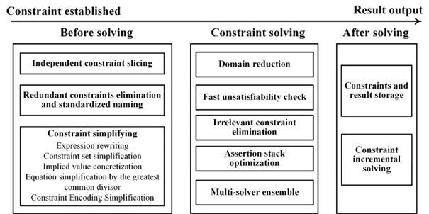

# Available optimizations for symbolic constraint solvers

## The optimization measures before the constraint solving

The optimizations performed before the constraint solving aim to preprocess the path constraints, therefore reducing the constraint complexity and facilitating the solver operation. For instance, independent constraint slicing [SP_Unleashing, ISSTA_Reuse], constraint simplifying [CUTE], standardized naming [Green], and redundant constraint elimination [ISSTA_Recal].

### Independent constraint slicing

This method splits the constraints into several independent constraint subsets and then solves them. In this way, the refined constraint slices reduce the difficulty of solving once and improve their utilization rate. For example, in the constraint set shown in the below figure, the constraints $C_3$ and $C_4$ are related, also $C_1$, $C_2$, and $C_5$ are related, so the whole constraint set can be divided into two sub-sets. 

### Constraint simplifying

This method reduces the complexity of contracts to facilitate the subsequent solving process. It mainly includes five optimizations.

1. Expression rewriting. It includes a set of classical optimizations, including simple arithmetic simplications (i.e., $x * 0 \to 0$ ), strength reduction (i.e., $x * {2^n} \to x \ll n$ ), and linear simplification (i.e., $2x - x \to x$ ).
2. Constraint set simplification. It converts and simplifies the existing constraints by using the defined range of symbolic variables, especially for the longer constraints. This is attributed to the value ranges of symbolic variables becoming more clear as the depth of constraints increases. For example, for the constraint $(x > 5) \wedge (x = 6)$ , the first item can be replaced with “true” or deleted. This optimization is currently used in KLEE. Subsequently, CUTE [CUTE] proposed a similar method called common sub-constraints elimination.
3. Implied value concretization. It simplifies constraints by solving variables with implicit values and substituting the actual values of these variables into the subsequent constraints. For instance, for the constraint $(x + 5 = 6) \wedge (x + y < 8)$ , the variable $x = 1$ can be obtained according to the first item, and it can simplify the second item to $y < 7$ , so this constraint becomes $(x = 1) \wedge (y < 7)$ . Nowadays, this optimization is applied in the tool KLEE.
4. Equation simplification by the greatest common divisor. It refers to the simplification of constraint equality or inequality by using divisors. For example, the inequality constraint $2x + 2y < 4$ can be simplified to $x + y < 2$ . This method is applied in Recal [ISSTA_Recal].
5. Constraint Encoding Simplification for arrays. Perry [ISSTA_Array] proposes to transform array operations into semantically equivalent simpler constraints, so that the efficiency of array operations can be improved.

### Redundant constraint elimination and standardized naming

The optimization removes duplicate or invalid constraints in the constraint set, which does not change the feasible domain and solving results of the constraints. For instance, for the constraint $(x + y < 3) \wedge (x + y < 2)$ , the former are redundant constraints, removing it can improve the solving efficiency. This optimization was adopted in Recal [ISSTA_Recal]. Besides, constraint normalization facilitates the identification of redundant constraints, that is, naming the constraints according to the logic of their expression. This can be attributed to the fact that constraints with the same semantics are expressed in the same way after standardized naming [Green].

## The optimization measures during the constraint solving.

The optimizations performed during the constraint solving refer to the operations related to solvers, including the domain reduce optimization, fast unsatisfiability check [CUTE], irrelevant constraint elimination [KLEE], assertion stack optimization [Incremental_Solving], and multi-solver ensemble [CAV_Multisolver, SMT_Concurrent].

### Domain reduction optimization

This method optimizes the solving process by qualifying the input domain based on the context information of constraints, as the smaller the input domain, the easier the solving. Specifically, only one symbolic variable is left, and other variables are replaced with actual values for solving. If there is no solving result, a symbolic variable is added until a solving result exists. During this process, the input domain of variables is gradually enlarged to reduce the difficulty of constraint solving. Ultimately, if there is no result, the elements in the input domain of variables will be enumerated, thereby turning the non-linear constraints into linear constraints. For instance, the non-linear constraint $({x^2} + y > 3) \wedge (x \in \mathbb{Z} ) \wedge (1 \le x \le 3)$ can be transformed into the linear one $(x = 1 \wedge {x^2} + y > 3) \vee (x = 2 \wedge {x^2} + y > 3) \vee (x = 3 \wedge {x^2} + y > 3)$ , which is more easily solved than before.

###  Fast unsatisfiability check

This method primarily focuses on operations of condition inversion caused by the path branch. The “unsat” result is obtained immediately when the condition conflict exists. For instance, for the existing constraint $(x > 5) \wedge (x \ge 6)$ , the constraint of another “if” branch is $(x > 5) \wedge (x < 5)$ , which has a logical conflict and the “unsat” decision can be output. This optimization was applied in CUTE and has been shown to effectively reduce solver executions by 60%~90% [CUTE].

### Irrelevant constraint elimination

This optimization is also for the reverse operation, which was applied in KLEE [KLEE]. It refers to that the variables related to the reverse condition only need to be resolved. This is because the constraints of other irrelevant variables have been solved. For example, for the current constraint $(x + y > 10) \wedge (z < 5) \wedge (y + 5 = 0)$ , the reverse constraint of the last item is $y + 5 \ne 0$ , thus the irrelevant constraint slice $z < 5$ does not need to be resolved.

### Assertion stack optimization

The assertion stack is maintained by the solver. Among them, the definitions and constraints of the same variables are shared. Therefore, using the assertion stack can accelerate the solving process of constraints. As with caching techniques, it has been proven to be effective [Incremental_Solving, KLEE].

### Multi-solver ensemble

As mentioned in Section 3.7, since different solvers have varying efficiency and are good at diverse solving theories, multiple solvers can be used based on the type of path constraints to enhance the constraint-solving performance. The following table presents relevant information on some main solvers, including the supported systems, built-in theories, and analysis times. For example, Z3 offers multiple API interfaces and implements various novel capabilities through built-in theories, but these implementations introduce some time overhead. In comparison, YICES demonstrates a higher analysis efficiency [ETHBMC]. Multi-solver ensemble has been utilized in [CAV_Multisolver, SMT_Concurrent] and has proven effective. Therefore, we added multiple solvers in the constraint-solving module, and they were tested to be used normally in Section 4.9. Users can choose to use any single solver or a combination of them based on their preferences. It's worth noting that as SMT solvers evolve, users can integrate novel and superior solvers with Python API interfaces into the open-sourced constraint-solving module by adding only a few codes.

Table. The details of main solvers.

| Solver | Supported system | SMT-LIB | Built-in theories | API | Applied tools | Analysis time
| :---: | :---: | :---: | --- | :---: |:---: | :---: |
| Z3 | Linux, Mac OS, Windows, FreeBSD | V2.0 | Empty theory, linear arithmetic, nonlinear arithmetic, bitvectors, arrays, datatypes, quantifiers, strings | C/C++, .NET, OCaml, Python, Java, Haskell | SAGE, Pex, KLEE | Medium |
| YICES | Linux, Mac OS, Windows | V2.0 | Rational and integer linear arithmetic, bitvectors, arrays, and equality over uninterpreted function symbols | C, Python | JPF/SPF, Crest | Fast |
| CVC3 | Linux | V1.2 | Empty theory, linear arithmetic, arrays, tuples, types, records, bitvectors, quantifiers  | C/C++, Python | JPF/SPF, Jalangi | Fast |
| CVC4 | Linux, Mac OS, Windows | V2.0 | Rational and integer linear arithmetic, arrays, tuples, records, inductive data types, bitvectors, strings, and equality over uninterpreted function symbols  | C++, Python | Certora | Fast |
| CVC5 | Linux, Mac OS, Windows | V2.0 | Rational and integer linear arithmetic, arrays, tuples, records, inductive data types, bitvectors, strings, sequences, bags, and equality over uninterpreted function symbols | C++, Python, Java | Certora, Atelier, Isabelle | Fast |
| STP | Linux, Mac OS, Windows, FreeBSD | Partial V2.0 | Bitvectors, arrays  | C/C++, Python, OCaml, Java | Bitblaze, KLEE, S2E | Medium |
| MathSAT | Linux | V2.0 | Empty theory, linear arithmetic, bitvectors | C/C++, Python, JAVA | N/A | Fast |
| SMT-RAT  | Linux, Mac OS | V2.0 | Linear arithmetic, nonlinear arithmetic | C++ | N/A | Fast |
Boolector | Linux | V1.2 | Bitvectors, arrays | C | N/A | Fast |
| OpenSMT | Linux, Mac OS, Windows | Partial V2.0 | Empty theory, differences, linear arithmetic, bitvectors  | C++ | N/A | Medium |
| veriT | Linux, OS X | Partial V2.0 | Empty theory, rational and integer linear arithmetics, quantifiers, and equality over uninterpreted function symbols | C/C++ | Isabelle/HOL | Medium |

## The optimization measures after the constraint solving

In this stage, two optimizations can be used to complete the caching and reuse of solving results, i.e., constraint data storage [ICSE_Memoise, Green] and incremental solving [KLEE].

### Constraints and result storage

The Trie tree is widely used to store constraints and their results, given that the unique tree structure makes the same constraint prefix not require duplicate storage [ICSE_Memoise, ISSTA_Memoized]. It is noteworthy that operations such as constraint slicing and normalization can improve the efficiency of constraint storage and reuse [SP_Unleashing]. Besides, the Redis database is also employed to enhance the efficiency of constraint management, given its interaction through memory space [Green].

### Constraint incremental solving

Since there are many common slices between adjacent constraints, the results of previous constraints can be reused when the solved constraint is a subset of them, thereby reducing the number of calls to solvers. This procedure is called incremental solving, which was used in the counter-example caching algorithm of KLEE [KLEE]. For instance, for the constraint and its result $(x > 6) \wedge (x + y < 12) \to \{ x = 7,y = 4\}$ , due to the constraint $x + y < 12$ is its subset, this constraint can use the result directly. In contrast, the constraint $(x > 12) \wedge (x + y < 12)$ need to be resolved as it is the superset of the storage constraint.

## References

- [SP_Unleashing] Sang Kil Cha, Thanassis Avgerinos, Alexandre Rebert, et al. Unleashing mayhem on binary code[C]//2012 IEEE Symposium on Security and Privacy. IEEE, 2012: 380-394.
- [ISSTA_Reuse] Xiangyang Jia, Carlo Ghezzi, Shi Ying. Enhancing reuse of constraint solutions to improve symbolic execution[C]//Proceedings of the 2015 International Symposium on Software Testing and Analysis. 2015: 177-187.
- [ISSTA_Recal] Andrea Aquino, Francesco A. Bianchi, Meixian Chen, et al. Reusing constraint proofs in program analysis[C]//Proceedings of the 2015 International Symposium on Software Testing and Analysis. 2015: 305-315.
- [ISSTA_Array] David Mitchel Perry, Andrea Mattavelli, Xiangyu Zhang, et al. Accelerating array constraints in symbolic execution[C]//Proceedings of the 26th ACM SIGSOFT International Symposium on Software Testing and Analysis. 2017: 68-78.
- [KLEE] Cristian Cadar, Daniel Dunbar, Dawson R. Engler. KLEE: Unassisted and automatic generation of high-coverage tests for complex systems programs[C]//OSDI. 2008, 8: 209-224.
- [CAV_Multisolver] Hristina Palikareva, Cristian Cadar. Multi-solver support in symbolic execution[C]//Computer Aided Verification: 25th International Conference, CAV 2013, Saint Petersburg, Russia, July 13-19, 2013. Proceedings 25. Springer Berlin Heidelberg, 2013: 53-68.
- [CUTE] Koushik Sen, Darko Marinov, Gul Agha. CUTE: A concolic unit testing engine for C[J]. ACM SIGSOFT Software Engineering Notes, 2005, 30(5): 263-272.
- [Incremental_Solving] Tianhai Liu, Mateus Araújo, Marcelo d'Amorim, et al. A comparative study of incremental constraint solving approaches in symbolic execution[C]//Hardware and Software: Verification and Testing: 10th International Haifa Verification Conference, HVC 2014, Haifa, Israel, November 18-20, 2014. Proceedings 10. Springer International Publishing, 2014: 284-299.
- [USENIX_ETHBMC] Joel Frank, Cornelius Aschermann, Thorsten Holz. ETHBMC: A bounded model checker for smart contracts[C]//Proceedings of the 29th USENIX Conference on Security Symposium. 2020: 2757-2774.
- [SMT_Concurrent] Christoph M. Wintersteiger, Youssef Hamadi, Leonardo Mendonça de Moura. A concurrent portfolio approach to SMT solving[C]//Computer Aided Verification: 21st International Conference, CAV 2009, Grenoble, France, June 26-July 2, 2009. Proceedings 21. Springer Berlin Heidelberg, 2009: 715-720.
- [ICSE_Memoise] Guowei Yang, Sarfraz Khurshid, Corina S. Pasareanu. Memoise: a tool for memoized symbolic execution[C]//2013 35th International Conference on Software Engineering (ICSE). IEEE, 2013: 1343-1346.
- [ISSTA_Memoized] Guowei Yang, Corina S. Pasareanu, Sarfraz Khurshid. Memoized symbolic execution[C]//Proceedings of the 2012 International Symposium on Software Testing and Analysis. 2012: 144-154.
- [Green] Willem Visser, Jaco Geldenhuys, Matthew B. Dwyer. Green: reducing, reusing and recycling constraints in program analysis[C]//Proceedings of the ACM SIGSOFT 20th International Symposium on the Foundations of Software Engineering. 2012: 1-11.
