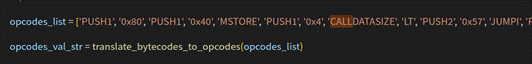
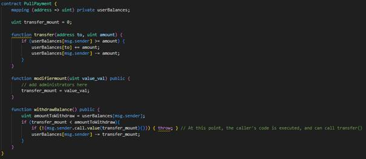
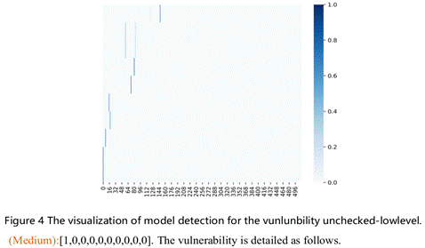
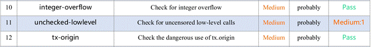
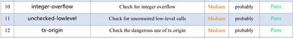

# File introduction of Ablation Experiments

## verification_examples_cooperation_instances.xlsx
The file "verification_examples_cooperation_instances.xlsx" describes the detection result of each method in the path ablation experiment. 

# The ablation experiments for detecting vulnerabilities that rely on multi-instance cooperation

In order to explore the key instance which enables VulHunter to identify the vulnerabilities, we performed the ablation experiments. Specifically, we delete the first and second cooperative functions in the contract to determine whether VulHunter can detect the vulnerability. The detection results of VulHunter and other methods are illustrated in the above table, and the details of other methods are illustrated in the file verification_examples.xlsx. They reflect that the latter instance (i.e., executing the latter function) is the key to triggering the vulnerability, and the former is the prerequisite for executing the latter. The detection for each contract example is detailed as follows.

## RedExchange contract (permission access control with tuples)

This contract is detailed in Section 4.5 of the paper, and its vulnerable code is shown in the above figure (also in Listing 5 of the paper). In this contract, the “payFund()” function is declared as public. Although this function is guarded with the “onlyAdministrator” modifier, anyone can become a member of administrators by invoking the “RedExchange” function. Moreover, the gas specified by the call function is too large, while the secure gas is usually 2300 ( $\ll$ 40,000). Thus, for this contract, attackers can construct an attacking contract and utilize the “setBondFundAddress()” function to set the withdrawal address “bondFundAddress” as the attacking contract address, thus realizing a reentrancy attack. However, methods such as Oyente, Mythril, and DefectChecker missed this vulnerability. We employed VulHunter to accurately discovered this vulnerability, and its detection result and the weight distribution is shown in the below figures.

Particularly, when “RedExchange” is not provided, the attackers will not be able to invoke “payFund” normally. In other words, the function's vulnerable execution path is inaccessible, and there is no vulnerability. However, VulHunter and other methods such as Slither will still identify this path that includes the reentrant call function, as shown in the below figures. It can be attributed to the invariable execution sequences. That is, the instance for executing “payFund” function have not been changed when “RedExchange” is not provided, and its weight distribution is also unaffected. As detailed in Section 5.2.2 of the paper, this fact can serve as a false positive of multi-instance cooperation.

On the contrary, VulHunter detects that the contract does not have reentrancy-eth vulnerability when payFund is deleted, as shown in the below figure.

Also, it accurately identifies the contract without “payFund” and “RedExchange” functions. 

## StandardToken contract (permission access control with owners)

In addition to access control with tuples, using owners of contracts to limit the identity of contracts is also an effective method to protect contract security. As detailed in Section 5.2.2, the StandardToken contract holds two functions, i.e., “modifierowner()” and “withdrawBalance()”. Attackers can first invoke the former function to change the owner of the contract, and bypass the permission of the latter function to execute the reentrancy attack. Specifically, VulHunter detected that this contract holds the reentrancy-eth vulnerability, as shown in the below figures. 

The above figures visualize the weight distribution of reentrancy-eth detector for the StandardToken contract. It detects the second instance holds the features of reentrancy-eth, and it accurately identifies the defective source code statement “msg.sender.call.value(amountToWithdraw)())” with 99.96% of confidence, as shown in the below figure. Yet, the methods based on symbolic execution (e.g., Mythril) and fuzz testing (e.g., SMARTIAN) missed it. This can be attributed to the fact that the flawed manual detection logic in symbolic execution rules or fuzz testing oracles makes the methods deliver false decisions. Also, ML-based arts (i.e., TMP and ContractWard) did not discover the vulnerability, given their unrefined contract inputs and unoptimized network structure. This reflects the following advantages of VulHunter: 

>1. It can accurately and automatically exploit the subtle features of the norm and defective contracts by using machine learning without expert participation.
>2. The use of attention and multi-example mechanisms enables the model to focus on the runtime execution paths and discover key opcode fragments, as well as defective code statements.

Similar to the first example, we delete the first execution function (i.e., modifierowner()), which is responsible for changing the owner of the contract. Normally, attackers cannot invoke the second defective function (i.e., withdrawBalance()) due to they are difficult to bypass the modifier verification. However, as shown in the below figures, VulHunter and most arts such as Slither, Securify, Oyente, and DefectChecker misreport it.

It can be attributed to the following facts. 
>1. The vulnerable path holds the invariance, that is, the deletion of the former instance does not change the latter instance, i.e., the weight distribution of the latter instance is not changed, as shown in the above figure.
>2. The static analysis methods cannot execute contracts, so that they are difficult to determine whether the instance can be achieved. Notably, DefectChecker ignores the use of SMT solvers to verify the feasibility of vulnerable paths. To this end, we implement and employ the constraint-solving module to automatically solve the constraints with the solvers such as Z3, Yices, and CVC4. However, as indicated in the below figures, the identify (i.e., caller or msg.sender) of the executor is solved to be the initial value of 0x0. This is because the module has currently implemented the constraint-solving and feasibility verification for the single path, and the parameter solving for multi-path execution has not been completed. Similarly, the non-implementation of multi-path constraints in methods such as Oyente leads to their false positives. 

In order to address this problem, VulHunter presents the following three possible solutions. 

>1. Continue to complete the constraint-solving module. In the future, VulHunter will build a state pool to maintain the values of storage variables during the continuous path operation, thus considering the impact of different path executions and facilitating contract analysis better.

>2. As one of the advantages of VulHunter, the location of the defective source code statements and key opcode subsequences helps in result verification by manual checking or methods (e.g., Oyente, DefectChecker, Manticore, and Securify) working at the source code and bytecode level. For example, Manticore supports source-level simulation execution (including contract creation and function calls) and automatic test-case generation based on constraint solving, as shown in the below figure. By using this tool for the mixed execution of defective code functions and their collaborating functions (e.g., holding the same read/write state variables), it is possible to observe whether the calls are performed successfully.

>3. Perform the vulnerable instances on the private chain. Similar to Maian and ETHBMC, VulHunter can build a private chain or simulated executor to execute the suspicious instances (i.e., opcode/bytecode sequences) with the values solved by symbolic constraints, and then observe whether the results are unexpected, thus discovering the false positives. This process is also similar to the above functions of Manticore.

It is noted that the contract without the latter function (i.e., withdrawBalance()) was detected accurately as secure by VulHunter, as shown in the below figure. This fact may reflect that the latter or last instance is most likely the basis for VulHunter identifying multi-instance collaboration vulnerabilities.

Furthermore, it accurately identifies the contract without “modifierowner()” and “withdrawBalance()” functions, i.e., the contract does not hold the reentrancy-eth vulnerability.

## PullPayment contract (cooperation between transfer amount and call function)

Different from the above two contract samples with permission access control, setting the transfer amount and invoking the call function is also a mode to collaborative trigger the reentrancy-eth vulnerability. As shown in the above figure, the PullPayment contract holds two main functions, i.e., “modifiermount(uint)” and “withdrawBalance()”. Attackers can first invoke the former function to set the transfer amount “transfer_mout” (the initial value is zero), and execute the latter function to perform the reentrancy attack. For this contract, VulHunter detected that it has a reentrancy-eth vulnerability, as shown in the below figures. 

Similar to the explanation for the above contract examples, the above figure visualizes the weight distribution of reentrancy-eth detector for the PullPayment contract. It detects the second instance holds the features of reentrancy-eth, and it accurately identifies the critical defective source code statement “msg.sender.call.value(transfer_mount)())” with 98.53% of confidence, as shown in the below figure. Yet, the methods based on symbolic execution (e.g., Mythril), fuzz testing (e.g., SMARTIAN), and ML(e.g., TMP) missed it. The specific reasons can be found in the description of the StandardToken contract.

We delete the first execution function (i.e., modifiermount (uint value_val)), which is responsible for setting the transfer amount. Normally, attackers cannot steal the contract balance by invoking the second defective function (i.e., withdrawBalance()), due to the transfer amount is the initial value of zero. Nonetheless, as shown in the below figure, VulHunter and most arts such as Slither, Securify, Oyente, and DefectChecker discover it, which is a false positive. The reasons are the same as the StandardToken contract without modifierowner() function. Notably, this problem needs to consider not only the feasibility of the execution path but also whether the transfer amount is zero. This is a special case of the reentrancy-eth vulnerability, which can be eliminated whether the vulnerability is triggered by replaying it and its collaboration paths (with common read/write state variables), similar to the solution mentioned above.

Furthermore, the contract without the latter function (i.e., withdrawBalance()) was detected accurately as secure by VulHunter, as shown in the below figure. This is consistent with the above contract examples.

Meanwhile, it accurately identifies the contract without “modifiermount (uint)” and “withdrawBalance()” functions.

## Vesting contract (TOD vulnerability)

TOD vulnerability refers to the inconsistent results caused by the different execution orders of two functions with associated relations (e.g., writing and reading the same state variables). Similar to the above vulnerabilities, it also requires two execution paths to cooperate with each other, and the absence of any function will prevent the vulnerability from being triggered. As shown in the above figures, the Vesting contract mainly has four functions, i.e., createVestinPeriod(address, uint256, uint256, uint256, address), release(address), \_releasableAmount(address), and \_vestedAmount(address). As detailed in Section 4.5, the state variable “tokenReward” is assigned in the former function and used in the latter three functions. When the transactions that invoke these functions appear in the same block, the miner can alter the order of the transactions resulting in an incorrect transfer account. As shown in the below figures, VulHunter successfully identified this contract with TOD vulnerability and located the defective source code statements involving the variables “tokenReward” and “\_released”, while methods such as Securify, TMP, and Oyente misreported them. 

Due to the reading of variables will be affected by their assignment operations, the functions that read the state variables act as the latter functions in triggering the TOD vulnerability, while the writing function serves as the former. We delete the former execution function (i.e., createVestingPeriod (…)), and there is no TOD vulnerability in the Vesting contract. However, as shown in the below figure, VulHunter and most methods such as Securify, Oyente, and ContractWard misreported it. The reasons are the same as the above contract examples. It is noted that this problem needs to consider not only the feasibility of the execution path but also whether the variable states can be affected by other path executions. This can be eliminated whether the vulnerability is triggered by replaying it and its collaboration paths (with common read/write state variables).

Then, we delete the latter execution functions (i.e., release(address), \_releasableAmount(address), and \_vestedAmount(address)) in the contract, and VulHunter accurately detects it as secure, as shown in the below figure. This is also consistent with the above contract examples.

Meanwhile, it also accurately identifies the contract without four functions as secure for the TOD vulnerability.

## AceDapp contract (arbitrary-send vulnerability)

The arbitrary-send vulnerability means that anyone can transfer money without being authenticated. It is dangerous, and the contract balance can be stolen by attacks easily. As shown in the above figure, the AceDapp contract mainly has three functions, i.e., init(), indirect(), and withdraw\_inderect(). Similar to the PullPayment contract that relies on two functions to set and transfer the ethers, attackers need to invoke init() and indirect()/withdraw\_inderect() functions in sequence to trigger the arbitrary-send vulnerability, thus transferring the contract balance to the specific address. For this contract, VulHunter successfully identified the arbitrary-send vulnerability, as shown in the below figures. 

The above figure visualizes the weight distribution of arbitrary-send detector for the AceDapp contract. As shown in the below figures, it detects two vulnerable instances and accurately identifies two critical defective source code statements “destination.send(val);” and “destination.send(address(this).balance)” with 71.31 % and 97.65% of confidence, respectively. Yet, the methods based on fuzz testing (e.g., SMARTIAN) and ML(e.g., TMP) missed it.

We delete the first execution function (i.e., init()), which is responsible for setting the transfer address. Normally, attackers cannot steal the contract balance to their specific address by invoking the second defective function (i.e., indirect()/withdraw_inderect()), due to the transfer address cannot be updated. However, as shown in the below figure, VulHunter misreported it. The reasons are the same as the PullPayment contract without modifiermount(uint value_val) function.

Then, the contract without the latter send function (i.e., indirect() and withdraw_inderect()) was detected accurately as secure by VulHunter, as shown in the below figure. This is consistent with the above contract examples.

Also, it accurately identifies the contract without these three functions as secure for the arbitrary-send vulnerability.

## MyConc contract (unchecked-lowlevel vulnerability under the permission access control with owners)

The unchecked-call vulnerability means that the contract execution leads to unexpected results when it ignores checking the execution status of call functions, given they cannot throw an exception and roll back all transactions when execution fails. For example, for the above contract, it has two functions, i.e., modify\_owner(address) and bad(uint, address). During the user invoking the bad function, the execution of the call function fails when the contract balance is less than Val, yet the value of the address “dst” in variable “balances” decreases. At this time, the user may invoke this function repeatedly, due to the function is invoked successfully but he does not receive the ethers, resulting in continuous loss of his assets. Similar to the StandardToken contract that relies on two functions to bypass the identity verification, attackers need to invoke modify\_owner(address) and bad(uint, address) functions in sequence to trigger the unchecked-lowlevel vulnerability. For this contract, VulHunter successfully identified this vulnerability, as shown in the below figures. 

The above figure visualizes the weight distribution of unchecked-lowlevel detector for the MyConc contract. As shown in the above figure, it detects the first instance holding the features of unchecked-lowlevel. Also, it accurately identifies the critical defective source code statement “dst.call.value(val)(“”);” with 88.16% of confidence. Yet, the methods based on symbolic execution (e.g., Mythril) and ML(e.g., TMP) missed it.

We delete the first execution function (i.e., modify\_owner(address)), which is responsible for changing the contract owner. Normally, attackers cannot trigger the unchecked-lowlevel vulnerability by invoking the second defective function (i.e., bad(uint, address)), due to the identity validation cannot be bypassed. However, as shown in the below figure, VulHunter and most arts such as SmartCheck, Slither, Securify, DefectChecker, and SMARTIAN still discover it, which is a false positive. The reasons are the same as the StandardToken contract without modifierowner() function.

Then, the contract without the latter defective function (i.e., bad(uint, address)) was detected accurately as secure by VulHunter, as shown in the below figure. This is consistent with the above contract examples.

Also, it accurately identifies the contract without these two functions as secure for the unchecked-lowlevel vulnerability.

