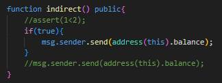
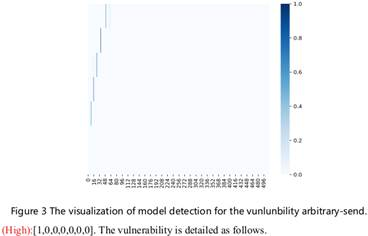
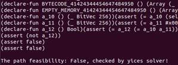
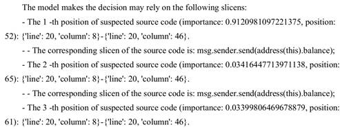
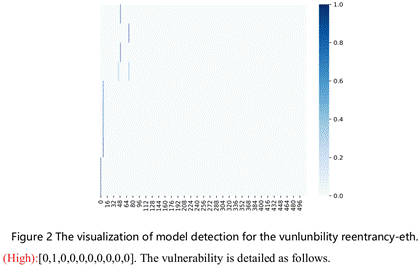
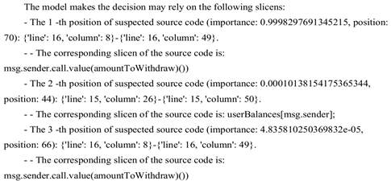
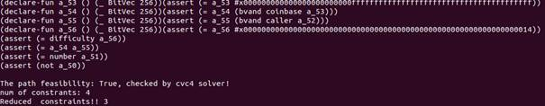
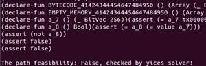

# File introduction of Infeasible Paths

## verification_examples_false_instances.xlsx
The file "verification_examples_false_instances.xlsx" describes the detection result of each method in the path verification experiment. 

# The capability of the constraint-solving module

## The verification experiments for contracts with infeasible paths

As detailed in Section 4.9 of the paper, we employed the optional symbolic-solving module to analyze some benign and malicious contract examples holding feasible/infeasible paths, thus evaluating its capabilities of constraint construction and feasibility validation. The experiment results are elaborated in the above table, and the part of other methods (e.g., SmartCheck and Securify) are illustrated in the file verification_examples.xlsx. On this page, we will detail the analysis process for these contract samples.

### CIN (with AS, arbitrary-send)

The arbitrary-send vulnerability means that anyone can transfer money without being authenticated. It is dangerous, and the contract balance can be stolen by attacks easily. For instance, as shown in the above figure, attacks can steal the contract balance by invoking the “indirect()” function. For this contract, VulHunter detected that it holds the arbitrary-send vulnerability, as shown in the below figures.

The above figures visualize the weight distribution of arbitrary-send detector for the CIN contract. It detects the first instance holds the features of arbitrary-send vulnerability, and it accurately identifies the defective source code statement “msg.sender.send(address(this).balance)” with 99.07% of confidence, as shown in the below figure. However, the methods based on fuzz testing (e.g., SMARTIAN) and ML(e.g., TMP) missed it. It can be attributed to the fact that the oracles of the fuzz testing-based methods adopt flawed detection logic. Also, the unrefined contract inputs and imperfect network structure make the ML-based methods insensitive to features of secure and vulnerable contracts. On the contrary, VulHunter uses attention and MIL mechanisms to focus on the runtime execution paths of contracts and employs a well-designed model to discover the defective contracts accurately. More importantly, compared to ML-based methods such as TMP, VulHunter can also identify defective source code statements, key opcode fragments, as well as vulnerable runtime execution opcode/bytecode sequences (i.e., instances), which can benefit the contract owner and auditor for more usages, such as vulnerability repair and result verification.

In order to validate the feasibility of this defective instance, we used Z3, Yices, and CVC4 as the verifiers of the constraint-solving module and employed them to solve the constraints constructed based on the instance. The verification results are shown in the below figures, and they all indicate that the vulnerable instance is feasible. Therefore, the CIN contract holds the arbitrary-send vulnerability.

 

### CIN_IFalse (without arbitrary-send, adding the false variable in the if condition)

As illustrated in Fig. 9 of the paper, the CIN contract is embedded with breaking operations such as if-false and assert-false to construct feasible and infeasible vulnerable paths. This makes the contracts with and without arbitrary-send vulnerabilities. As shown in the above figure, the CIN_IFalse contract uses the statement if-false to prevent the function from executing the dangerous send function. Nonetheless, VulHunter and most arts such as Slither still identify it, which is a false positive.

Specifically, as shown in the above figure, the statement if-false introduces almost little difference at the instance level. VulHunter still discovered the defective source code statement “msg.sender.send(address(this).balance);” with 96.58% of confidence, as depicted in the below figure. As we mentioned in Section 4.9 of the paper, this can be attributed to the following facts. (i) The result similarity invariance for the same/similar vulnerable paths, that is, the little differences do not change the predicted results of models. (ii) The vulnerable paths cannot actually be executed by methods based on static analysis and ML, so that their feasibility cannot be validated.

In order to eliminate this false positive, we employ the symbolic-solving module to construct and solve the constraints of vulnerable instances, similar to the above verification of the CIN contract. As shown in the below figures, all solvers indicated that this vulnerable instance is infeasible, thus correcting the detection results.

 

### CIN_ITrue (with arbitrary-send, adding the true variable in the if condition)

As experimented on above, the symbolic-solving module can eliminate false positives. In order to further verify whether this module will make VulHunter miss vulnerabilities, we change the statement if-false to if-true, as shown in the above figure. As depicted in the below figure, VulHunter successfully discovered the arbitrary-send vulnerability, yet methods based on fuzz testing (e.g., SMARTIAN) and ML (e.g., ContractWard) missed it. The reasons for their misreports are the same as that of the CIN contract.

Due to the almost the same paths and only one different opcode 0x0 (False) and 0x1 (True), the weight distribution is the same as the CIN_IFalse contract. Similarly, VulHunter also identified the defective source code statement “msg.sender.send(address(this).balance);” with 96.58% of confidence, as depicted in the below figure.

In order to validate the feasibility of this defective instance, we also employed the symbolic-solving module to solve the constraints constructed based on vulnerable instances. The verification results are shown in the below figures, and all solvers indicated that the vulnerable instance is feasible. Therefore, the CIN_ITrue contract holds the arbitrary-send vulnerability.

 

### CIN_IOFalse (without arbitrary-send, adding the false comparison in the if condition)

In order to evaluate the effectiveness of the symbolic-solving module under variable computation, we replaced the statement if-false with the computation “1>2”, as shown in the above figure. Similarly, as depicted in the below figure, VulHunter and most arts such as Slither still identify it, which is a false positive.

Specifically, as shown in the above figure, VulHunter discovered two vulnerable instances and identified the defective source code statement “msg.sender.send(address(this).balance);” with 87.65% of confidence, as depicted in the below figure.

In order to eliminate these two false positives, we employ the symbolic-solving module to solve the constraints of vulnerable instances. As shown in the below figures, all solvers indicated that both vulnerable instances are infeasible, thus correcting the detection results.

### CIN_IOTrue (with arbitrary-send, adding the true comparison in the if condition)

Similarly, we replaced the statement if-true with the computation “1<2”, as shown in the above figure. This contract holds the arbitrary-send vulnerability, given the send function can be invoked by attackers. As depicted in the below figure, it is noted that VulHunter identified the arbitrary-send vulnerability in the CIN_IOTrue contract, yet methods based on fuzz testing (e.g., SMARTIAN) and ML (e.g., ContractWard) missed it. These detection results are similar to the CIN_ITrue contract.

Due to the almost the same paths and only one different opcode LT (Less-than) and GT (Greater-than), the weight distribution and detection results are similar to the CIN_IOFalse contract. VulHunter also discovered two vulnerable instances and identified the defective source code statement “msg.sender.send(address(this).balance);” with 96.58% of confidence, as depicted in the below figure.

In order to validate the feasibility of these defective instances, we also employed the symbolic-solving module to solve the constraints constructed based on vulnerable instances. The verification results are shown in the below figures, and all solvers indicated that the vulnerable instance is feasible. Therefore, the CIN_IOTrue contract holds the arbitrary-send vulnerability.

 

### CIN_AFalse (without arbitrary-send, adding the false variable in the assert condition)

Similar to the operation if-false, assert-false also can break the execution of functions. As shown in the above figure, the statement “assert(false);” prevent the function from executing the dangerous send function. Nonetheless, VulHunter and most arts such as Slither still identify it, which is a false positive.

Similar to the CIN_IFalse contract, the statement assert-false also introduces almost little difference at the instance level, as shown in the above figure. VulHunter still discovered the defective source code statement “msg.sender.send(address(this).balance);” with 91.69 % of confidence, as depicted in the below figure. The reasons for this false positive are the same as the detection for the CIN_IFalse contract.

In order to eliminate this false positive, we also employ the symbolic-solving module to solve the constraints of vulnerable instances. As shown in the below figures, all solvers indicated that this vulnerable instance is infeasible, thus correcting the detection results.

### CIN_ATrue (with arbitrary-send, adding the true variable in the assert condition)

Then, we change the statement assert-false to assert-true, as shown in the above figure. As depicted in the below figure, VulHunter successfully discovered the arbitrary-send vulnerability, yet methods based on fuzz testing (e.g., SMARTIAN) and ML (e.g., ContractWard) missed it. The reasons for their misreports are the same as that of the CIN contract.

Due to the almost the same paths and only one different opcode 0x0 (False) and 0x1 (True), the weight distribution is the same as the CIN_AFalse contract. VulHunter also identified the defective source code statement “msg.sender.send(address(this).balance);” with 91.69% of confidence, as depicted in the below figure.

In order to validate the feasibility of this defective instance, we also employed the symbolic-solving module to solve the constraints constructed based on vulnerable instances. The verification results are shown in the below figures, and all solvers indicated that the vulnerable instance is feasible. Therefore, the CIN_ATrue contract holds the arbitrary-send vulnerability.

### CIN_AOFalse (without arbitrary-send, adding the false comparison in the assert condition)

Similar to the CIN_IOFalse contract, we replaced the statement assert-false with the computation “1>2”, as shown in the above figure. Similarly, as depicted in the below figure, VulHunter and most arts such as Slither still identify it, which is a false positive.

As shown in the above figure, VulHunter detected the first instance holds the features of arbitrary-send, and it identified the defective source code statement “msg.sender.send(address(this).balance);” with 98.03% of confidence, as depicted in the below figure.

In order to eliminate this misreport, we employ the symbolic-solving module to solve the constraints of the vulnerable instance. As shown in the below figures, all solvers indicated that it is an infeasible path, thus correcting its detection result to benign.

### CIN_AOTrue (with arbitrary-send, adding the true comparison in the assert condition)

Similarly, we replaced the statement assert-true with the computation “1<2”, as shown in the above figure. This contract holds the arbitrary-send vulnerability, given the send function can be invoked by attackers. As depicted in the below figure, VulHunter identified the arbitrary-send vulnerability in the CIN_AOTrue contract, yet methods based on fuzz testing (e.g., SMARTIAN) and ML (e.g., ContractWard) missed it.

Similar to the detection for the CIN_IOTrue contract, the different computations (i.e., greater than and less than) hardly change the runtime execution sequence, so that the weight distribution and detection results are similar to the CIN_AOFalse contract. VulHunter also discovered two vulnerable instances and identified the defective source code statement “msg.sender.send(address(this).balance);” with 97.87% of confidence, as depicted in the below figure.

In order to validate the feasibility of these defective instances, we also employed the symbolic-solving module to solve the constraints constructed based on vulnerable instances. The verification results are shown in the below figures, and all solvers indicated that the vulnerable instance is feasible. Therefore, the CIN_AOTrue contract holds the arbitrary-send vulnerability.

### Agent (with IO, integer-overflow)

The integer-overflow vulnerability means that numeric operations on variables may exceed the limits of their types without result checking, resulting in inconsistent operation results. For instance, as shown in the above figure, due to the values of variables “a” and “b” can be inputted by the users, the operation “a+b” may exceed the range represented by the uint variable, i.e., 0~232-1. Normally, the send operation cannot be executed in the bad function, given that the result of computation “a+b” must be larger than 20. However, when its result outs of 232-1, the value of the variable “val” is a+b-232+1, thus sending ethers to attackers. For this contract, VulHunter successfully detected that it holds the integer-overflow vulnerability, as shown in the below figures. Yet, methods based on fuzz testing (e.g., SMARTIAN) and ML (e.g., TMP) missed it, given their imperfect oracles and network structures.

As shown in the above figure, VulHunter identified the fifth instance that holds the features of integer-overflow and located the variable operation with 87.52% of confidence. In order to validate the feasibility of the vulnerable execution paths and obtain their invoking inputs, we used Z3, Yices, and CVC4 as the verifiers of the constraint-solving module and employed them to solve the constraints constructed based on the execution paths. The validation results are shown in the below figures, and all solvers indicate that the constraints can be satisfied with the inputs “x=2147483643” and “y=1073741851”.

Therefore, on the one hand, the symbolic-solving module can verify the feasibility of the vulnerability paths by determining whether their constraints can be solved. On the other hand, as mentioned in Section 4.9 of the paper, it makes methods such as VulHunter and Oyente hold more capabilities, e.g., obtaining the inputs that restore the vulnerable execution paths to trigger the vulnerability. For this contract, attackers can invoke the “bad” function with the above solved inputs to cause numerical overflow and get unexpected results, i.e., earning ether benefits. 

### ARP (with RE, reentrancy-eth)

As shown in the above figure, the “withdrawBalance()” function is declared as public, and anyone can execute the call function to withdraw ethers by invoking this function. Also, the call function does not limit the gas overhead, so that attackers can construct an attacking contract and realize a reentrancy attack to extract the ethers continuously. We employed VulHunter to accurately discover this vulnerability, as depicted in the below figures.

As shown in the above figure, VulHunter detects the second instance holds the features of reentrancy-eth vulnerability, and it accurately identified the key CALL instruction and located the defective source code statement “msg.sender.call.value(amountToWithdraw)()” with 99.98% of confidence, as shown in the below figure. However, methods such as DefectChecker, SMARTIAN, and ContractWard missed this vulnerability.

In order to validate the feasibility of this defective instance, we employed the symbolic-solving module to solve the constraints constructed based on the instance. The verification results are shown in the below figures, and all solvers indicate that the vulnerable instance is feasible. Therefore, the ARP contract holds the reentrancy-eth vulnerability.

### APR_IFalse (without reentrancy-eth, adding the false variable in the if condition)

Similar to the CIN_IFalse contract, the APR_IFalse contract also uses the statement if-false to prevent the function from executing the dangerous call function, as shown in the above figure. Nonetheless, as depicted in the below figures, VulHunter and most arts based on pattern matching (e.g., Slither) and pattern analysis (e.g., Securify) still identified it, which is a false positive.

Due to the statement if-false introducing almost little difference at the instance level, VulHunter still located the defective source code statement “msg.sender.send(address(this).balance);” with 96.58% of confidence, as shown in the below figure.

In order to eliminate this false positive, we employ the symbolic-solving module to solve the constraints based on the vulnerable instance. As shown in the below figures, all solvers indicated that this vulnerable instance is infeasible, thus correcting the false positive.

### Cloud (with BP, block-other-parameters)

As shown in the above figure, the “bad0()” function is declared as public, and the send function is executed when the block parameters meet the conditions, e.g., block.coinbase\=\=msg.sender. However, these parameters can be known in advance or manipulated by miners and nodes, so that attackers can conspire with them to steal the contract’s balance. We employed VulHunter to accurately discovered this defect, as depicted in the below figures.

As shown in the above figure, VulHunter detects the second and third instances that hold the features of block-other-parameters defect. Also, as illustrated in the below figure, it accurately identified the defective source code statement “block.coinbase\=\=msg.sender” and “block.number\=\=20” with 99.89% and 0.04% of confidence, respectively. However, methods such as Mythril, SMARTIAN, and ContractWard missed this vulnerability.

In order to validate the feasibility of these defective instances, we employed the symbolic-solving module to solve the constraints constructed based on the instances. The verification results are shown in the below figures, and all solvers indicate that both defective instances are feasible. Therefore, the Cloud contract holds the block-other-parameters defect.

### Cloud_AFalse (without block-other-parameters, adding the false variable in the assert condition)

Similar to the CIN_AFalse contract, the Cloud_AFalse contract also uses the statement assert-false to prevent the function from executing the require and send function, as shown in the above figure. Nonetheless, as depicted in the below figures, VulHunter and DefectChecker still identified it, which is a false positive.

Similar to the Cloud contract, VulHunter still located the defective source code statement “block.coinbase\=\=msg.sender;” with 66.00% of confidence, as shown in the below figure.

In order to eliminate these false positives, we employ the symbolic-solving module to solve the constraints based on the defective instances. As shown in the below figures, all solvers indicated that these defective instances are infeasible, thus correcting the false positives.

### Caller (with LLC, low-level-calls)

As shown in the above figure, the “callvalue(address)” function is declared as public, and anyone can invoke it to execute the call function. In order to remind contract developers to focus on dangerous operations, we employed VulHunter to accurately highlight the call function, as depicted in the below figure.

As shown in the above figure, VulHunter detects the first and second instances that hold the features of low-level-calls defect. Also, as illustrated in the below figure, it accurately identified the defective source code statement “\_receiver.call.value(msg.value).gas(7777)("")” with 97.19% of confidence, respectively. However, methods such as TMP and ContractWard missed this defect.

In order to validate the feasibility of these defective instances, we employed the symbolic-solving module to solve the constraints constructed based on the instances. The verification results are shown in the below figures, and all solvers indicate that both defective instances are feasible. Therefore, the Caller contract holds the low-level-calls defect.

### Caller_AOFalse (without low-level-calls, adding the false comparison in the assert condition)

Similar to the CIN_AOFalse contract, the Caller_AOFalse contract also uses the statement assert-false assert-false with the computation “1>2” to prevent the function from executing the call function, as shown in the above figure. Nonetheless, as depicted in the below figures, VulHunter, Slither, and SmartCheck still identified it, which is a false positive.

Similar to the Caller contract, VulHunter still located the defective source code statement “\_receiver.call.value(msg.value).gas(7777)("")” with 98.48% of confidence, as shown in the below figure.

In order to eliminate these false positives, we employ the symbolic-solving module to solve the constraints based on the defective instances. As shown in the below figures, all solvers indicated that these defective instances are infeasible, thus correcting the false positives.

### Aether (with ST, send-transfer)

As shown in the above figure, the “sendvalueassert(address)” function transfers ethers through a send operation. It is noted that both the send and transfer functions specify that the operation has a limit of 2300 gas, but a failure of the send function does not trigger the exception and can be reentered easily. Thus, developers are recommended to use the transfer function. To this end, we employed VulHunter to accurately highlight the send function in the Aether contract, as depicted in the below figure.

As shown in the above figure, VulHunter detects the fourth instance that holds the features of send-transfer defect. Also, as illustrated in the below figure, it accurately identified the defective source code statement “_receiver.send(msg.value)” with 75.29% of confidence, respectively. However, methods such as TMP and ContractWard missed this defect.

In order to validate the feasibility of this defective instance, we employed the symbolic-solving module to solve the constraints constructed based on the instance. The verification results are shown in the below figures, and all solvers indicate that the defective instance is feasible. Therefore, the Caller contract holds the send-transfer optimization.

### AEther_IFalse (without send-transfer, adding the false variable in the if condition)

Similar to the CIN_IFalse contract, the AEther_IFalse contract also uses the statement if-false to prevent the function from executing the send function, as shown in the above figure. Nonetheless, as depicted in the below figures, VulHunter and SmartCheck still identified it, which is a false positive.

Similar to the AEther contract, VulHunter still located the defective source code statement “_receiver.send(msg.value)” with 91.67% and 78.66% of confidence, respectively, as shown in the below figures.

In order to eliminate these false positives, we employ the symbolic-solving module to solve the constraints based on the defective instances. As shown in the below figures, all solvers indicated that these defective instances are infeasible, thus correcting the false positives.

## The experiment conclusion for the constraint-solving module

As described above, this module has implemented the constraint-solving and feasibility verification for the single path. Nevertheless, parameter solving for multi-path execution has not been completed, which is detailed in Section 5.2.2 of the paper and the following contents on this page. This is the main reason for the constraint-solving used as an optional component in VulHunter. Also, time consumption is another factor that needs to be considered, given the constraint construction and solver computation are related to the states, such as the length and number of paths. It is noted that the feasibility validation enables VulHunter to eliminate some infeasible paths, rather than all of the false positives, due to some norm instances being wrongly identified by models with the features of vulnerabilities. In order to correct these misreports, VulHunter present three available suggestions based on traditional formal methods, such as fuzz testing and pattern matching. 

>1. Continue to complete the constraint-solving module. 
>2. Verify the correctness of the located defective source code statements and key opcode subsequences by manual checking or methods (e.g., Oyente, DefectChecker, Manticore, and Securify) working at the source code and bytecode level. 
>3. Perform the vulnerable instances actually on the private chain. These recommendations will be detailed in the following content.
