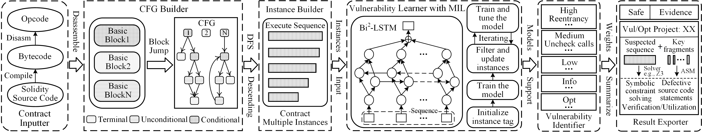

# VulHunter, an detection method based on multi-instance learning and machine learning for Ethereum smart contracts


VulHunter is a method that can effectively detect bytecode/opcode paths that trigger vulnerabilities without manual pre-defined patterns. It employs multi-instance learning (MIL) and Bag-instance/self-model attentions based Bi-directional Long Short-Term Memory (Bi$^2$-LSTM) model to inspect the execution path of contract bytecode. It is written in Python 3 with12K lines of code. Furthermore, It can detect contract vulnerabilities more accurately, efficiently, and robustly than the SOTA methods. More importantly, it can produce classification results while providing the vulnerable runtime execution sequences, which can benefit the secondary validation and vulnerability repair. 



- [Bugs and Optimizationimizations Detection](#bugs-and-Optimizationimizations-detection)
- [How to Install](#how-to-install)
- [Publications](#publications)

## Bugs and Optimizationimizations Detection

Run VulHunter on a Truffle/Embark/Dapp/Etherlime application:
```bash
python main.py
```

Run VulHunter with the Bi$^2$-LSTM model on a single file:
```bash
python main.py test Bi2LSTM BitsForAI.sol
```

Run VulHunter with the Bi$^2$-LSTM model and output the results to a json file:
```bash
python main.py test Bi2LSTM BitsForAI.sol --json BitsForAI.json
```

Run VulHunter with the Bi$^2$-LSTM model and output the result report without defective source code statements:

```bash
python main.py test Bi2LSTM BitsForAI.sol --report --nomap BitsForAI-nomap.pdf
```

Run VulHunter with the Bi$^2$-LSTM model and output the result report with defective source code statements:

```bash
python main.py test Bi2LSTM BitsForAI.sol --report --map BitsForAI-map.pdf
```

Run VulHunter with the Bi$^2$-LSTM model and output the main result report without defective source code statements:

```bash
python main.py test Bi2LSTM BitsForAI.sol --report-main --nomap BitsForAI-main-nomap.pdf
```

Run VulHunter with the Bi$^2$-LSTM model and output the main result report with defective source code statements:

```bash
python main.py test Bi2LSTM BitsForAI.sol --report-main --map BitsForAI-main-map.pdf
```

Run VulHunter and train the Bi$^2$-LSTM model:

```bash
python main.py train Bi2LSTM train_dataset_dir models_dir
```

Run VulHunter and train the other model:

```bash
python main.py train other_model_name train_dataset_dir models_dir
```

Employ solc with mutiple Solidity version such as 0.4.24 to compile source code into bytecode, and utilise pyevmasm 0.2.3 based on EVM to disassemble the bytecode to its opcode.

### Detectors

Num | Detector | What it Detects | Impact | Confidence | Severity
--- | --- | --- | --- | --- | ---
1 | `reentrancy-eth` | Re-entry vulnerabilities (Ethereum theft) | High | probably | High
2 | `controlled-array-length` | Length is allocated directly | High | probably | High
3 | `suicidal` | Check if anyone can break the contract | High | exactly | High
4 | `controlled-delegatecall` | The delegate address out of control | High | probably | High
5 | `arbitrary-send` | Check if Ether can be sent to any address | High | probably | High
6 | `tod` | Transaction sequence dependence for receivers/ethers | High | probably | High
7 | `uninitialized-state` | Check for uninitialized state variables | High | exactly | High
8 | `parity-multisig-bug` | Check for multi-signature vulnerabilities | High | probably | High
9 | `incorrect-equality` | Check the strict equality of danger | Medium | exactly | Medium
10 | `integer-overflow` | Check for integer overflow/overflow | Medium | probably | Medium
11 | `unchecked-lowlevel` | Check for uncensored low-level calls | Medium | probably | Medium
12 | `tx-origin` | Check the dangerous use of tx.origin | Medium | probably | Medium
13 | `locked-ether` | Whether the contract ether is locked | Medium | exactly | Medium
14 | `unchecked-send` | Check unreviewed send | Medium | probably | Medium
15 | `boolean-cst` | Check for misuse of Boolean constants | Medium | probably | Medium
16 | `erc721-interface` | Check the wrong ERC721 interface | Medium | exactly | Medium
17 | `erc20-interface` | Check for wrong ERC20 interface | Medium | exactly | Medium
18 | `costly-loop` | Check for too expensive loops | Medium | possibly | Low
19 | `timestamp` | The dangerous use of block.timestamp | Low | probably | Low
20 | `block-other-parameters` | Hazardous use variables (block.number etc.) | Low | probably | Low
21 | `calls-loop` | Check the external call in the loop | Low | probably | Low
22 | `low-level-calls` | Check low-level calls | Info | exactly | Info
23 | `erc20-indexed` | ERC20 event parameter is missing indexed | Info | exactly | Info
24 | `erc20-throw` | ERC20 throws an exception | Info | exactly | Info
25 | `hardcoded` | Check the legitimacy of the address | Info | probably | Info
26 | `array-instead-bytes` | The byte array can be replaced with bytes | Opt | exactly | Opt
27 | `unused-state` | Check unused state variables | Opt | exactly | Opt
28 | `costly-operations-loop` | Expensive operations in the loop | Opt | probably | Opt
29 | `send-transfer` | Check Transfe to replace Send | Opt | exactly | Opt
30 | `boolean-equal` | Check comparison with boolean constant | Opt | exactly | Opt
31 | `external-function` | Public functions can be declared as external | Opt | exactly | Opt

## How to install

VulHunter requires Python 3.6+, PyTorch 1.10.2+, [solc](https://github.com/ethereum/solidity/) and pyevmasm 0.2.3+.

### Using Git

```bash
git clone https://github.com/ContractAudit/VulHunter.git && cd VulHunter
```

Of course, VulHunter can also be deployed in a virtual environment. This project provides a virtual environment by default, under the venv folder. Execute the following command to start the virtual operating environment.

```bash
source venv/bin/activate
```

If you want to recreate the virtual environment, perform the following operations.

```bash
virtualenv --python=/usr/bin/python3.7 venv
pip install pytorch
pip install sklearn
pip install pyevmasm
pip install py-solc
pip install jpype1
pip install reportlab
pip install numpy
pip install pandas
pip install tqdm
pip install oscillo
```

## License

VulHunter is licensed and distributed under the AGPLv3 license.


## Publications

### References
- [ReJection: A AST-Based Reentrancy Vulnerability Detection Method](https://www.researchgate.net/publication/339354823_ReJection_A_AST-Based_Reentrancy_Vulnerability_Detection_Method), Rui Ma, Zefeng Jian, Guangyuan Chen, Ke Ma, Yujia Chen - CTCIS 19
- [DefectChecker: Automated Smart Contract Defect Detection by Analyzing EVM Bytecode](https://ieeexplore.ieee.org/document/9337195), Jiachi Chen, Xin Xia, David Lo, John Grundy, Xiapu Luo, Ting Chena, Yujia Chen - IEEE TSE
- [Smart Contract Vulnerability Detection using Graph Neural Network](https://www.ijcai.org/proceedings/2020/454), Yuan Zhuang, Zhenguang Liu, Peng Qian, Qi Liu, Xiang Wang, Qinming He - IJCAI 20
- [Slither: A Static Analysis Framework For Smart Contracts](https://arxiv.org/abs/1908.09878), Josselin Feist, Gustavo Grieco, Alex Groce - WETSEB '19
- [ETHPLOIT: From Fuzzing to Efficient Exploit Generation against Smart Contracts](https://wcventure.github.io/FuzzingPaper/Paper/SANER20_ETHPLOIT.pdf), Qingzhao Zhang, Yizhuo Wang, Juanru Li, Siqi Ma - SANER 20
- [SmartCheck: Static Analysis of Ethereum Smart Contracts](https://orbilu.uni.lu/bitstream/10993/35862/3/smartcheck-paper.pdf), Sergei Tikhomirov, Ekaterina Voskresenskaya, Ivan Ivanitskiy, Ramil Takhaviev, Evgeny Marchenko, Yaroslav Alexandrov - WETSEB '18
